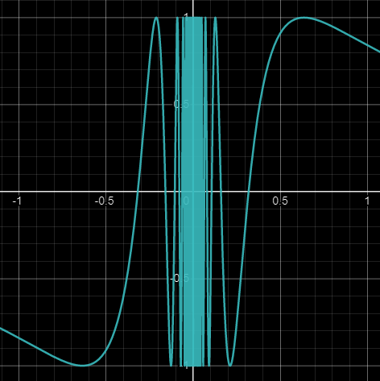

# Generating Random Numbers?

Well before we dive into procedural generation we need to know what exactly is procedural generation, right? Well procedural generation is letting the computer generate something based on certain parameters we give it as an input.

Now where do we need randomness? Or do we really need randomness for procedural generation?
The short answer is no we don't.

However if as we get into more complicated things randomness plays a very important role. Randomness makes out procedurally generated creations interesting. As I said before procedural generation is basically giving the computer certain parameters and letting it generate something for us. So a simple use of randomness will be randomly generating those parameters using certain rules and we have a system that can generate several different but similar in nature results easily. Now this is just a simple example of using random numbers, as we learn more about procedural generation we see more uses so for now lets see what these random numbers are and how can we get them?

Now (almost)every programming languages standard library provides some sort of function to generate **random** numbers.
For example:

```
Math.random(); // Java & JavaScript
rand(); // C/C++
System.Random // C#
random.randrange(0, 10) // python
```

Now if you are reading this article about procedural generation I am pretty sure you have used some of these random number functions before.

But have you every thought about how they work?

I mean lets think how can we say something is a random number?

Ask yourself to tell a random number?

How did you do it?

Computers are not intelligent beings like us. They just run algorithms. So computers cannot really generate a random numbers!

But we do have these functions which gives us random seeming numbers, right?
Well these functions internally use some algorithms internally to generate these random seeming numbers.
What I am calling _random seeming numbers_ are properly termed **pseudo-random numbers**.

Now since we are using algorithms to generate these, so are they predictable, right?
The answer would be **kind of**.

**NOTE:** _Every different language's standard library has their own method to do this so what I am talking about is the general idea._

To understand what I mean we need to take a look at some of the methods to generate the random numbers.

Before going into some proper or sophisticated method lets try to deduce some of our own methods to random numbers.

### Using Irrational Numbers

As you might guess irrational numbers like **PI** or the **Euler's number** are a decent source of randomness.

Lets see **PI**:

```
3.14159265358979323846264338327950288419716939937510
```

Here you can see that the digits of **PI** are seemingly random. Now whether they are truly random or now is a topic for further debate, but for simple things this randomness is enough.

### A simple `random()` function

Now lets try to implement a simple function that gives a random number in range `[0.0, 1.0]`
Lets think mathematically are there any functions that has some randomness.

What's the simplest one that comes to your mind?

The simplest such function that comes to my mind is:

$$
f(x) = \sin \( \frac{1}{x} \)
$$

It looks like:



So here you can see it quite random in the range `[-0.05, 0.05]`.

Now how to utilize this?

Well for every random number function there is something called a seed.

**What is a seed?**
Well its any number provided to the random number generator with respect to which our function generates a random number. What can be the seed? anything 1, 2, 3, ... and no matter how the seeds are related be they in **AP** (Arithmetic Progression) or anything the number returned by a **good** random number generator will be totally random and will not be increasing or decreasing with the seed!

Now what about the seed in the random number functions we use in various programming languages?
Well they are there but some are initialized by default by the library itself and some are not. And why is the seed not required for every call to the random function in out libraries?

Well there are 2 simple possible answers (there may be more but for simplicity sake lets only deal with these 2):

- A new seed is somehow generated? How ? (take a guess : the current time is a decent seed right?)
- The last randomly generated number is the seed for the next!

**Extra Info:** For C or C++ `rand()` if you just use it you will face confusing issue that every time the program is run the set random numbers is the same! Here is the solution to that.

```c
srand((unsigned int)time(NULL)); // add this somewhere before rand() is called
```

What this does is set the seed to the random number generator to the current time.

Now back to our random function, we need to somehow map our seed the `[-0.05, 0.05]` range.

What is the easiest way to do it? -> `sin` or `cos`

So our new function becomes:

$$
f(x) = \sin \( \frac{1}{ 0.05 \cos x } \)
$$

Lastly one thing is this functions numbers in range `[-1.0, 1.0]` but we want `[0.0, 1.0]` there are several ways to map this but lets again choose the easiest way -> `abs`

Lets try and see what result does this provide?

I am going to implement this in JavaScript

```javascript
// default seed maybe startup
// time to generate new sets
// of random number on every run
var seed = 42;
function random() {
  let out = Math.abs(Math.sin(1.0 / (0.05 * Math.cos(seed))));
  seed = out * 1000;
  return out;
}
```

Now for our case we are going to use the last generated random number as our seed.

Lets see the result:

```javascript
for (let a = 0; a < 10; a++) console.log(random());
```

Output:

```
0.2606030304241584
0.9808953818956047
0.990705467311925
0.4260738993003614
0.5282333810739287
0.17452669194990883
0.017978476874086123
0.3523627897884388
0.7539293841139144
0.9239994632661684
```

Now as we can see we are getting quite random looking numbers.

**NOTE:** _I am not mathematically analyzing any of these functions_

Now lets take a look at some real life random number generation algorithms:

### Linear congruential generator

This can be said as one of the simplest an most popular **RNG** (Random Number Generator).

**Fun Fact:** _ `java.util.Random` and C's `rand()` also use this algorithm_

The function we use for this is:

$$
f(x) = (a \times seed + c) \\ mod \\ m
$$

Where,

m ( 0 < m ) is called the **modulus**,

a ( 0 < a < m) is called the **multiplier**

c ( 0 < c < m ) is called the **increment**

seed ( 0 <= seed < m) is called the **seed**

Now, the quality of random numbers depends on the value chosen for `m`, `a`, `c`.

You can check the default parameters values for these 3 used in various places [here](https://en.wikipedia.org/wiki/Linear_congruential_generator)

Now if we check the Microsoft's version of C standard library's `rand()`

Here is a simplified version ([original source](https://stackoverflow.com/a/40687065/14911094)):

```c
int seed = 42;
int __cdecl rand (void)
{
    return seed = ( ((seed * 214013L+ 2531011L) >> 16) & 0x7fff );
}
```

### Xorshift

This too is a pretty simple algorithm.
To quote from Wikepedia,

> They generate the next number in their sequence by repeatedly taking the exclusive or of a number with a bit-shifted version of itself

Again the quality of random numbers is totally dependent on the parameters chosen.

Here is a C implementation of the algorithm:

```c
unsigned int seed = 42;
unsigned int rand()
{
	unsigned int x = seed;
	x ^= x << 13;
	x ^= x >> 17;
	x ^= x << 5;
	return seed = x;
}
```

Well those were some examples of some simple RNGs. There are many more of them. If you are using random numbers in C++ you must have heard about `std::mt19937` right? It is a Mersenne Twister pseudo-random generator of 32-bit numbers with a state size of 19937 bits. It is based on the Mersenne Prime :

$$
2^{19937} - 1
$$

Learn [more](https://en.wikipedia.org/wiki/Mersenne_Twister).

Now with that we come to an end of the discussion of algorithms to generating random numbers.

### Real Random Numbers?

So what about real random numbers? Though for our purpose we don't really need them but lets think of a few ways to generate them.

A simple way could be to do a computationally heavy task and check the time take by that since it depends on the other processes running, CPU temperature, etc it will be kind of random then we can feed it to the RGSs we discussed as seed.

Another way could be read the mouse movements (we will use this for procedural generation later), read data from microphone or webcam. You could try and connect to a server and check the time taken for response (latency) its kind of random, there are many ways to do it.

A fun way to do it would be let your cat run free on your keyboard!

[Here](https://www.youtube.com/watch?v=1cUUfMeOijg&ab_channel=TomScott) you can see Lava Lamps being used to generate random numbers.

So with this we come to an end of this article.
