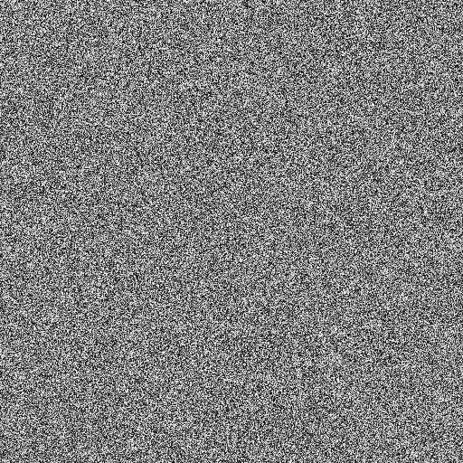
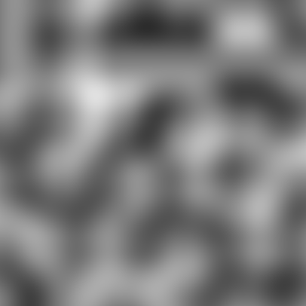
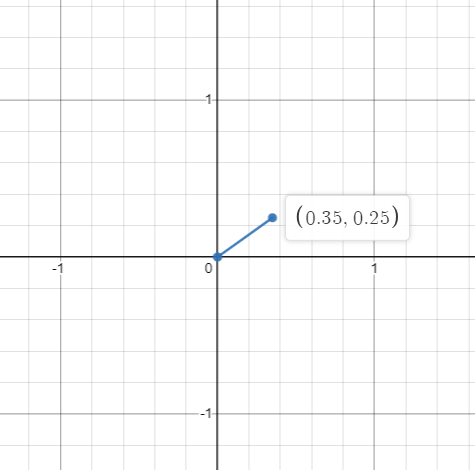
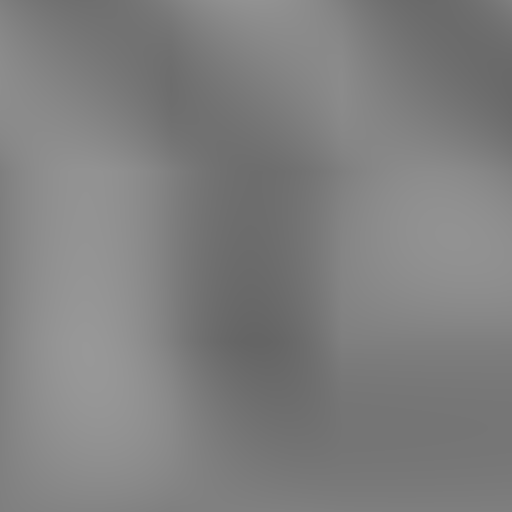
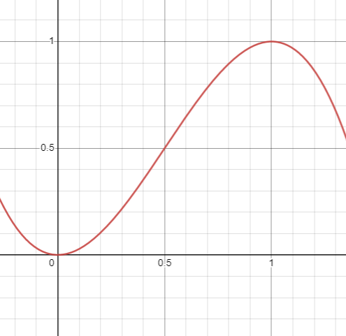
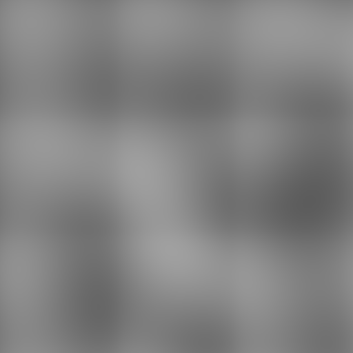

# Perlin's Noise Algorithm

# What is Noise?

Well if you have tried to learn about anything in procedural generation one thing you must have come across is **noise**! Now, what exactly is it?

Well, noise is nothing but a collection of random values.

To be honest, that is all there to noise at the core, but as you can guess it's not that simple.

To be a bit more technical, noise is a function. A function that takes N parameters and gives us a value following some rules(rules depend on the algorithm we are talking about).

Now depending on the number of parameters we can classify noise into 1-Dimensional, 2-Dimensional, 3-Dimensional, etc. And the range of value it gives us also depends on the algorithm we are talking about.

Now there are several uses for each type of noise but according to me it's easiest to work with **2D** noise while implementing the algorithms in the first place as it's really easy to visualize.

**How?**

Through _textures_ (images)!

Once we have an algorithm setup for 2D we can generalize it to 1D, 3D, etc. (at least most of the time)

Ok, so how do we generate a texture using our noise function?

Here is some pseudocode:

```c
for(int i = 0 ; i < image.height ; i++)
{
    for(int j = 0 ; j < image.width ; j++)
    {
        float n = noise( (float)j / image.width , (float)i / image.height );
        n = n / NOISE_MAX; // calculate noise in range [0, 1]
        image.SetPixel(j, i, n, n, n); // set (R, G, B) values at pixel (j, i)
    }
}
```

Now now, let us see what's going on.

We loop throughout pixels and set them to the value generated by our noise function taking the **x and y** coordinates as input.

Now you may think why am I dividing the **x and y** coordinates by the width and height?

Well, it is to normalize them and map them to the \[0, 1) range (open at one as `i`, `j` starts from `0` and goes only till `width - 1`, `height - 1`).

**Why do we do it?**

I can't answer it just yet, so let's just follow it blindly for now. In the future when we will be talking about applying transformations on these noise functions we will see how we can transform these parameters to transform the noise into something we want. But that's something for the future.

Alright now, what about the noise function?

Let's just try and use our [rand() function from the previous article](/blog/01-generating-random-numbers) and see how it looks.

```c
float noise(float x, float y)
{
    return rand(x + y);
}
```

NOTE: _We are using the x and y coordinates as the seed here._

The output:



Cool right?

Nope?

Well, you can say it's not very interesting in itself, right?

**What do I mean?**

Well, everything is very random and we can't distinguish any particular pattern or any feature.

So, what do I mean by interesting?

Let's see,



So, it seems a bit more interesting, right?

As you can now distinguish some features or patterns yet the thing is quite random in itself right?

It's termed Coherent Noise.

It is a smooth version of our previous noise functions using `rand()` (a **pseudo-random** noise function)

There are some basic properties of a coherent noise function:

- Passing in the same input value will always return the same output value (same for almost all noise algorithms)
- A small change in the input value will produce a small change in the output value
- A large change in the input value will produce a random change in the output value

# Perlin's Noise Algorithm

Well, there are several algorithms to generate coherent noise and we will be covering them one by one.

But undoubtedly the most famous of all noise algorithms is **Perlin Noise**.

To quote some history about this from Wikipedia,

> Ken Perlin developed Perlin noise in 1983 as a result of his frustration with the "machine-like" look of computer-generated imagery (CGI) at the time. He formally described his findings in a SIGGRAPH paper in 1985 called An Image Synthesizer. He developed it after working on Disney's computer animated sci-fi motion picture Tron (1982) for the animation company Mathematical Applications Group (MAGI). In 1997, Perlin was awarded an Academy Award for Technical Achievement for creating the algorithm.

NOTE: _The implementation of the Perlin Noise algorithm in this article is from_ [_here_](https://cs.nyu.edu/~perlin/doc/oscar.html#noise)

Alright, getting into the algorithm.

So, we know that the input to our noise function will be 2 numbers on the 2D plane.



So, as you can see from the above graph, every point in the 2D plane is inside a square whose corners coordinates are the nearest integers to the coordinates of the point.

We can easily get the coordinates of the four corners of the square using:

We have our point as

$$P = (x, y)$$

Now our corner coordinates of the square are:

$$P_0 = (floor(x), floor(y))$$

$$P_1 = (floor(x), floor(y) + 1)$$

$$P_2 = (floor(x) + 1, floor(y))$$

$$P_3 = (floor(x)+1, floor(y)+1)$$

Now Perlin's algorithm states that for each of these four points, we have a random precalculated [unit vector](https://en.wikipedia.org/wiki/Unit_vector). And now we calculate the vector from these four points to the current input point **_P_**. Now we have 4 pairs of vectors (one the precalculated random vector and the other the one we calculated).

Then we need to find the dot product of these 4 vector pairs. Then we have to mix these four dot product values and hurray we got out the noise!

Now that was a lot so let's get to all that one by one while implementing it in code.

First of all the precalculated vectors.

So you might ask that, well there are infinite integers so how can we precalculate that? right?

Well, this brings us to one of the biggest disadvantages of Perlin's Algorithm.

Since we cannot precalculate infinite values what is done in the original algorithm is we precalculate a set of 256 random **unit vectors** and an array of 256 random permutations called the **permutation table**. And using this we choose a random vector for each integer point. Thus as you might guess the noise will start repeating after 256. Well for now let's not worry about that and try to set up our own precalculated set of vectors.

Now, let us declare a global array for storing these vectors.

```cpp
static Vector2 gradients[B + B + 2];
static int permutation[B + B + 2];
```

NOTE: Perlin originally called these gradients and the permutation table.

So, what is this B out here?

If we see the original implementation we find `#define B 0x100`. Now, what does this mean?

If you are attentively following till now or are somewhat versed with hexadecimal numbers you can tell here B is just `256` or the number of permutations.

Now here we calculate 512 gradients than the original size of 256 to prevent buffer overflows.

So, the code calculating them looks like this,

```cpp
for (int i = 0 ; i < B ; i++)
{
    permutation[i] = i;
    gradients[i] = Vector2.Random();
    gradients[i] = Vector2.Normalize(gradients[i]);
}
for (int i = 0, j = 0 ; i < B ; i++)
{
    int k = permutation[i];
    permutation[i] = permutation[j = random() % B];
    permutation[j] = k;
}
for (i = 0 ; i < B + 2 ; i++)
{
    permutation[B + i] = permutation[i];
    gradients[B + i] = gradients[i];
}
```

Now, that is a lot going on here. Let us try to break it down.

First, we go from `0` to `B` (`256`) and set the value of permutation at the index `i` to `i` itself. Also, set the value of the gradient at the index `i` to a random 2D vector and then we normalize it. Normalizing means making the vector a unit vector(vector of magnitude 1.0).

Note we have got all our permutations set to the indices they are at which is remotely not close to something we can call random. So now we need to randomize it.

We again loop through `0` to `B` (`256`) and swap each element with a random element in the array. This is a clever way to have an array of random elements within range (0 - 255) without them repeating at all.

If you are struggling to understand this line of code,

```cpp
permutation[i] = permutation[j = random() % B];
```

Well, all it does is first generate a random number using some pseudo-random number generation function like the `rand()` function we discussed in the previous article. Then we calculate the random value modulo B so that we can wrap the random value in the \[0, B) range. Then we set its value to `j` so that we can use it later to swap the value of permutation at index `j`.

Lastly, we just copy the value from \[0, 256) over to the second half of the tables.

Now, the main part is the algorithm itself.

Let's see it slowly.

```cpp
float rx0 = x - (int)x;
float rx1 = rx0 - 1.0f;
float ry0 = y - (int)y;
float ry1 = ry0 - 1.0f;
```

Here we calculate the vector from the bounding square's coordinate to the point we are evaluating our nose at.

Alright, next we need to calculate the four random vectors corresponding to the four corner points.

```cpp
int bx0 = ((int)x) & 255;
int by0 = ((int)y) & 255;
int bx1 = (bx0 + 1) & 255;
int by1 = (by0 + 1) & 255;
```

Well, what exactly is this?

First, we calculate the corner point to the lower left of the point `[bx0, by0]`. Now, earlier I showed some formulas for calculating these using floor functions but Perlin did this using some clever math. Let's try to understand that.

First converting the point coordinate to an integer which replicates the effect of the `floor(x)`. Then there is an interesting bit of math thingy here.

Note that,

$$x \ \% \ 2^n = x \ \& \ 2^{n-1}$$

So, we can say that here all we are doing is,

```cpp
int bx0 = ((int)x) % 256;
int by0 = ((int)y) % 256;
int bx1 = (bx0 + 1) % 256;
int by1 = (by0 + 1) % 256;
```

This modulo is being calculated so that the `bx0` and `bx1` and `by0` and `by1` are within the range \[0, 256).

Next up,

```cpp
int i = permutation[bx0];
int j = permutation[bx1];

int b00 = permutation[i + by0];
int b10 = permutation[j + by1];
int b01 = permutation[i + by0];
int b11 = permutation[j + by1];
```

Now, here we are calculating 4 indexes to sample the random vector from our gradients table, based on the values of `x`, `y`.

**NOTE:** Here if you notice, `i`, `j` is in the range \[0, 256) and `by0`, `by1`, `bx0`, `bx1` are also in the range \[0, 256). And we are adding them this the value is in the range \[0, 512). This is the reason we made the size of `permutation` array to be `B + B + 2`.

Next up,

```cpp
float u = Vector2.Dot(gradients[b00], Vector2(rx0, ry0));
float v = Vector2.Dot(gradients[b10], Vector2(rx1, ry0));
float a = Lerp(rx0, u, v);
```

Here, we calculate the dot product of the gradient we sampled and a vector from the values of the point we are trying to calculate the noise.

**NOTE:** Here you are kind of free to do something else too. We will try something different a bit later.

Also then we are interpolating the values of those two (u, v) using `rx0` as a factor.

`Lerp` means Linear Interpolation. And it looks something like,

```cpp
float Lerp(float t, float a, float b)
{
    return ( a + t * (b - a) );
}
```

Now we need to do the same thing with the other 2 vector sets too.

```cpp
u = Vector2.Dot(gradients[b01], Vector2(rx0, ry1));
v = Vector2.Dot(gradients[b11], Vector2(rx1, ry1));
float b = Lerp(rx0, u, v);
```

This was about interpolating the two dot products in the X-axis. We similarly repeat the same thing in the Y-axis too and return the result.

```cpp
return Lerp(ry0, a, b);
```

Alright!

We have implemented Perlin noise.

Or at least most of it.

Now before we try and see what this looks like we need to make some changes to the function creating the image!

```cpp
for(int i = 0 ; i < image.height ; i++)
{
    for(int j = 0 ; j < image.width ; j++)
    {
        float n = noise( 3.0f * (float)j / image.width , 3.0f * (float)i / image.height );
        n = n * 0.5f + 0.5f; // calculate noise in range [0, 1]
        image.SetPixel(j, i, n, n, n); // set (R, G, B) values at pixel (j, i)
    }
}
```

Again, try to ignore why we are doing this now. I will make a separate article about this specifically. And if you are curious, you can search about scaling and offsetting coordinates.

Now that is out of the way, let's see what this looks like.



Well, that's ok.

But I did skip a particular part in the implementation. That is the smoothing curve.

You see, we interpolated the values using `rx0` and `ry0` directly. But Perlin, in his original implementation, passed these through a curve.

The curve is,

$$y = x^2 ( 3 - 2x)$$

This looks like,



Now, all we need to focus on is the \[0, 1\] range as our `rx0` and `ry0` will always be within that range. We can see that in that range this function is a smooth S-shaped curve.

Now, this changes our code to,

```cpp
float a = Lerp(SCurve(rx0), u, v);
float b = Lerp(SCurve(rx0), u, v);
return Lerp(SCurve(ry0), a, b);
```

Let's see how this looks.



Well, that is the original Perlin noise!

But, hang on!

This is not the same as what we saw in the example up there. Right?

Well, it's true. They are different. You see, the algorithm we discussed here is the **original** algorithm given by Ken Perlin. But after a few years of giving this algorithm, he improved this in some ways, like he changed the smoothing curve, the way gradients are calculated, etc. And that will be the topic of our next article.

Thank you for reading through this!
