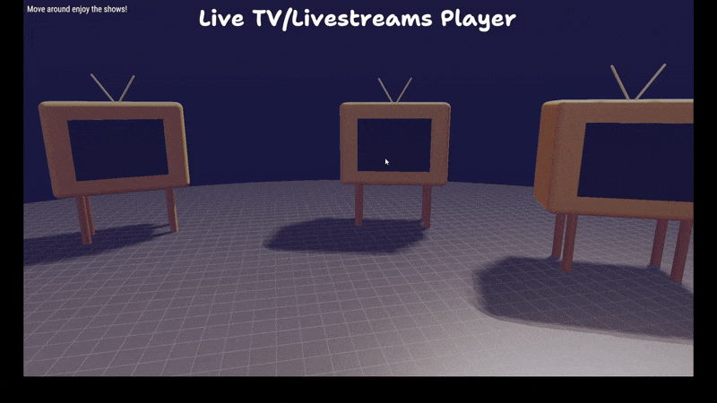
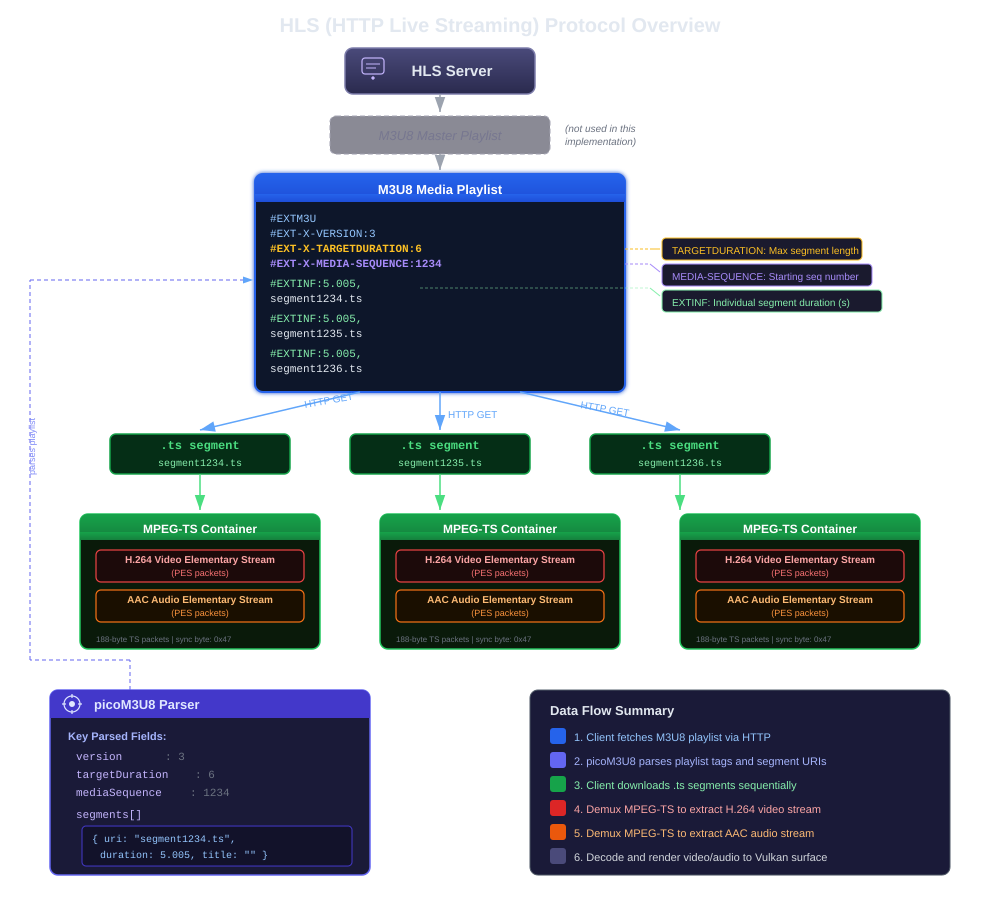
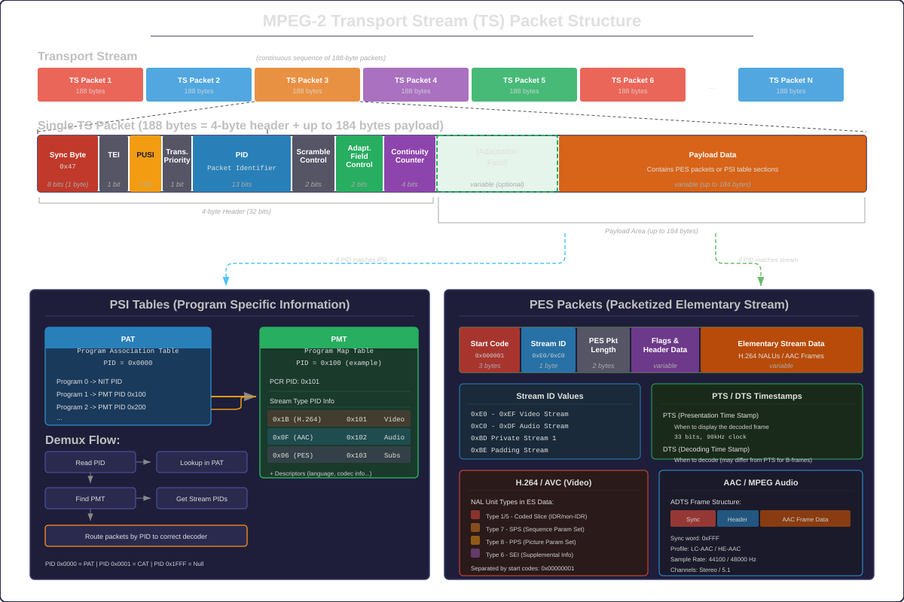
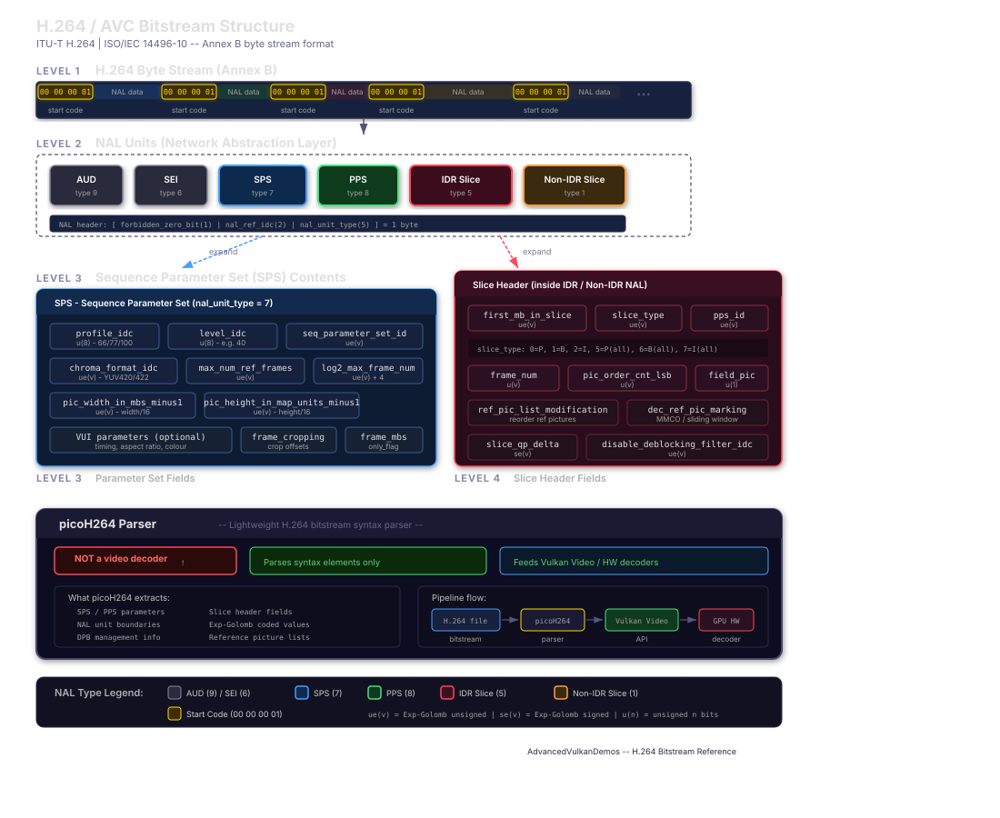
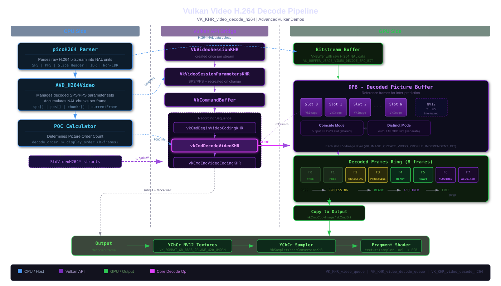
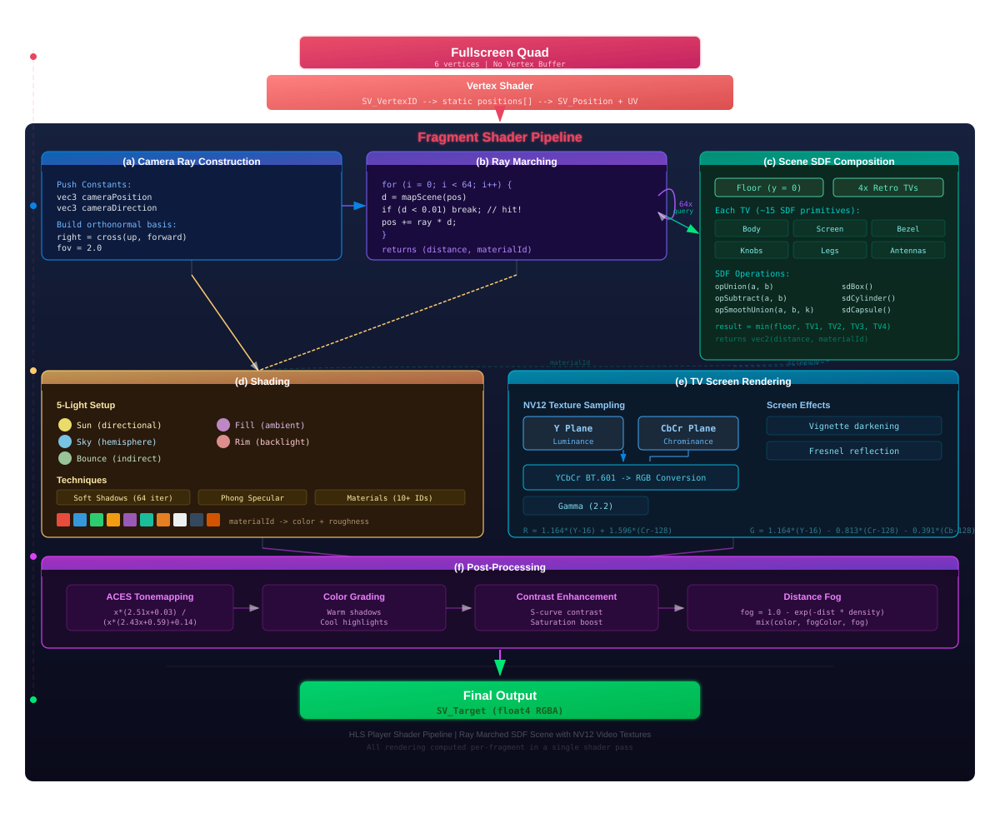
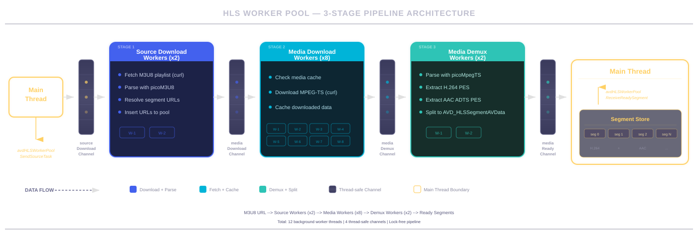

*A better quality video is available in the [Demo section](#demo) below.*


## The idea? 

Before actually diving into the technical details, let me share my motivation for this project. 

I have been playing around with the Vulkan Video Extensions for a bit now, for projects here and there and I do really like it, but never really had the chance to go a bit futher with it, starting from the very basics, so I was indeed searching for an excuse to make something big with it.

And then one day, while working for another project, I had to deal with setting up a video stream locally for some tests, and I had to read up a bit on how HLS(HTTP Live Streaming) works and the plumbing around it, it was simple with a couple `ffmpeg` commands and setting up a basic server nothing fancy(for thats all I needed). But this got me really curios in the inner workings of how it worked. And the DUMB me of the time though *"Hey that seems rather easy doesnt it? Its just dumping chunks and playing them right?"* and I though why not use this idea to actually satisfy my itch of working with Vulkan Video in a more meaningful way, as in I wont be building yet another *Simple* video player, but something much more interesting.

And this it, and over the course of a few weeks I came to realize how utterly wrong I was thinking that its so simple, and was facinated by literally how much is happening behind the scnes and how much tech is involved for something as common as watching a video on youtube.

---

## The constraints?

Now, I do like to make a lot of things from scratch rather than using existing libraries, and however stupid my reasoning may sound it is: most of the time I am too lazy to just learn the APIs of a new library and get used to the patterns used there for my personal projects. And whats wrong with re-inventing a worse version of the wheel when its a hobby project just for fun? So to challenge myself in this case too, I gave myself a constraint, I cannot use any existing library for the media work. Anything else is fine, like I all good with GLFW, or stuff like using something to do the networking for me as I have no interest in building a TCP stack here.

So it leaves us with. No FFmpeg. No libav. No GStreamer. No parsers/demuxers for the HLS playlists, or the Transport stream files or even the H264 files, all that has to be made by me.

This constraint led to the creation of three entirely new libraries. all part of the [libpico](https://github.com/Jaysmito101/libpico) project, my version of stb, a collection of single header C libraries:

1. **picoM3U8**: A parser for HLS M3U8 playlists, implementing the relevant portions of [RFC 8216](https://datatracker.ietf.org/doc/html/rfc8216).
2. **picoMpegTS**: A demuxer for MPEG Transport Streams, implemented based on the [ITU-T H.222.0](https://www.itu.int/rec/T-REC-H.222.0-202308-S/en) specification.
3. **picoH264**: A parser for H.264/AVC bitstreams, implemented based on the [ITU-T H.264 (V15)](https://handle.itu.int/11.1002/1000/15935) specification.

Additionally, a fourth library was created:

4. **picoAudio**: A cross platform audio decoding library using OS-native APIs (Media Foundation on Windows, AudioToolbox on macOS)

Each of these libraries took me weeks of work reading specifications, writing parsers, debugging edge cases, and testing against real world media streams(which I swear are very rare find public ones due to copyright issues). Together they form a complete media pipeline that can take a URL pointing to an HLS stream and spit out raw decoded video frames and PCM audio samples without a single line of code from any existing media framework.

Alright lets dive into each piece of this puzzle, starting with the protocol that makes it all possible.

---

## Understanding HLS

Before we look at any code, we need to understand what HLS actually is and how it works right? HTTP Live Streaming was initially developed by Apple and published as an RFC (RFC 8216), its basically an adaptive bitrate streaming protocol that delivers media content over standard HTTP connections.


*NOTE: This diagram is AI-generated as I ran out of patiance trying to make it by hand, but I tried my best to ensure that the information is accurate, is there are any issues please forgive me for that, and feel free to reach out.*

### The HLS Architecture

At its core, HLS is pretty simple in concept:

1. A media encoder takes a live video/audio feed and encodes it into one or more quality levels (bitrates). Also it could be coming from multiple cameras or audio sources, lets say two different cameras for the same event.
2. A stream segmenter divides the encoded media into small files called media segments, typically 2-10 seconds long(can be variable and can change during streaming, atleast from what I have seen).
3. An index file (the M3U8 playlist) is generated that lists the URLs of these segments in order.
4. A web server hosts both the playlist and the media segments.
5. A client fetches the playlist, determines which segments to download, downloads them, and plays them back.

Now for live streams, the playlist is continuously updated by the server with new segments as they become available. The client just keeps re-fetching the playlist to discover new content.

One really interesting part here is it is named "HTTP Live Streaming" but it is really just for Live content, you can stream any content even pre-recorded ones with this protocol.

Another interesting thing is that HLS works with any plain old static HTTP file server, there is no special server side logic, its just updating the static files, its the client taht manages all the complexity of fetching the playlist, parsing it, downloading the segments, and playing them back in the correct order. This is one of the reasons why HLS is so widely adopted it can be served from any CDN or web server without special configuration.

### Playlist Types

HLS defines two types of playlists:

**Master Playlists** contain references to multiple variant streams, each at a different bitrate or resolution or even different sources like multiple streams from different camera angles. This enables adaptive bitrate streaming, that is, the client can switch between quality levels based on network conditions. A master playlist looks something like this:

```
#EXTM3U
#EXT-X-STREAM-INF:BANDWIDTH=1280000,RESOLUTION=1280x720
http://example.com/720p.m3u8
#EXT-X-STREAM-INF:BANDWIDTH=2560000,RESOLUTION=1920x1080
http://example.com/1080p.m3u8
```

**Media Playlists** contain the actual references to media segments. These are what the player downloads and plays. A media playlist looks like:

```
#EXTM3U
#EXT-X-VERSION:3
#EXT-X-TARGETDURATION:10
#EXT-X-MEDIA-SEQUENCE:2680
#EXTINF:9.009,
http://example.com/segment2680.ts
#EXTINF:9.009,
http://example.com/segment2681.ts
#EXTINF:9.009,
http://example.com/segment2682.ts
```

The `#EXT-X-MEDIA-SEQUENCE` tag tells the client the sequence number of the first segment in the playlist. For live streams, the server removes old segments and adds new ones, incrementing this number. The `#EXTINF` tag specifies the duration of each segment in seconds. And honestly for a bare bones player like ours, this is all we need to know.

### Media Segments

In HLS, media segments are typically packaged as MPEG Transport Stream (.ts) files, though fragmented MP4 (fMP4) is also supported in newer versions but for simplicity's sake lets pretend we dont know about that. Each .ts file contains multiplexed audio and video elementary streams wrapped in PES (Packetized Elementary Stream) packets, which are themselves carried in 188-byte transport stream packets.

And this is where the complexity really starts kicking in. To get from a .ts file to raw video frames and audio samples, you need to:

1. Parse the MPEG-TS container to extract individual PES packets.
2. Figure out which PES packets contain video (H.264) and which contain audio (typically AAC ADTS).
3. Reassemble the video elementary stream from the PES packet payloads.
4. Parse the H.264 bitstream to extract individual frames (NAL units).
5. Decode the NAL units using a video decoder (in our case, the Vulkan Video hardware decoder).
6. Decode the audio elementary stream (AAC) into PCM samples for playback.
7. And at every point of time ensure that we are keeping everything in sync, that is the audio and video are played back at the correct times according to their timestamps.

Yeah. Each of these is a pretty serious engineering challenge on its own. Lets tackle them one at a time.

---

## Part I: Parsing HLS Playlists (picoM3U8)

So M3U8 files are basically extended M3U (multimedia playlist) files encoded in UTF-8. Now you might think they are just text files with tags and thats kind of true, but a correct parser has to handle a surprising number of edge cases and tag types.

### The M3U8 Specification

I implemented the parser based on [RFC 8216](https://datatracker.ietf.org/doc/html/rfc8216), which defines the HLS protocol. The RFC has a ton of tags, each with specific syntax rules and semantics. The most important ones for our purposes are:

- `#EXTM3U`: Must be the first line; identifies the file as an Extended M3U file.
- `#EXT-X-VERSION`: Specifies the compatibility version of the playlist.
- `#EXT-X-TARGETDURATION`: The maximum duration of any media segment in the playlist.
- `#EXT-X-MEDIA-SEQUENCE`: The media sequence number of the first media segment in the playlist.
- `#EXTINF`: Specifies the duration and optional title of the next media segment.
- `#EXT-X-KEY`: Specifies how media segments are encrypted (if at all, as playing encrypted streams is way beyond the scope of this project).
- `#EXT-X-STREAM-INF`: Specifies a variant stream in a master playlist.

### Library Design

I choose to go with the stb stile of library design, and kept a super simple C API for the parser:

```c
picoM3U8Result picoM3U8PlaylistParse(
    const char *data,
    uint32_t dataSize,
    picoM3U8Playlist *outPlaylist
);

void picoM3U8PlaylistDestroy(picoM3U8Playlist playlist);
```

The `picoM3U8Playlist` structure differentiates between master playlists (containing variant stream references) and media playlists (containing segment URIs). The parser identifies the playlist type automatically during parsing.

### Parsing Strategy

The parser works line-by-line. Each line is classified as either:
- A **tag line** (starts with `#EXT`).
- A **comment line** (starts with `#` but not `#EXT`).
- A **URI line** (anything else: the URI of a media segment or variant stream).

For tag lines, the parser extracts the tag name and its attribute list (if any). Attributes are comma-separated key-value pairs, where values can be quoted strings, integers, floating-point numbers, or enumerated values.

Now I wont be going into the nitty gritty of the parser itself, as you are free to check the code if you are curious, but in general the idea is simple, we dectect the type of play list anf then parse according to that, as the types of tages for either is different, for example in a media playlist we care about `#EXTINF` and `#EXT-X-MEDIA-SEQUENCE`, while in a master playlist we care about `#EXT-X-STREAM-INF`. 

Now one thing to mention for those interested in implementign their own parser, that in a lot of cases the fields in the playlists can be shared across multiple segments that is if you encounter a certain tag once in a file you keep setting that data for all the upcoming segments until you encounter that tag again, for example the `#EXT-X-KEY` tag which specifies the encryption method and key URI for the segments, if it is present in the playlist, it is usually only present once at the top of the file, and then all segments are encrypted with that key, so you can just store that information in the playlist structure and apply it to all segments without needing to parse it again for each segment.

**How do we detect the type of playlist?**

I wanted to have a really simple way of determining whether a file is a master playlist or a media playlist, and if possible without even parsing it. So what I ended up doing is go through the file un parsed, and look for the string ".m3u8" in the lines, if we find it, then we can be pretty sure that this is a master playlist, as media playlists typically do not reference other playlists, but rather media segments which are usually .ts files.

In the HLS player scene, the M3U8 parser is used in the source download worker thread(we will get to what that is soon). When a source URL is fetched, the raw text content is passed to `picoM3U8PlaylistParse`. The resulting playlist structure is then iterated to extract media segment URLs:

```c
picoM3U8Playlist playlist = NULL;
picoM3U8Result result = picoM3U8PlaylistParse(data, (uint32_t)strlen(data), &playlist);

if (result != PICO_M3U8_RESULT_SUCCESS) {
    AVD_LOG_ERROR("Failed to parse HLS playlist: %s", picoM3U8ResultToString(result));
    return;
}

if (playlist->type != PICO_M3U8_PLAYLIST_TYPE_MEDIA) {
    AVD_LOG_ERROR("Master playlists are not supported yet");
    return;
}

for (uint32_t i = 0; i < playlist->media.mediaSegmentCount; i++) {
    picoM3U8MediaSegment segment = &playlist->media.mediaSegments[i];
    // resolve relative URL, enqueue for download...
    segmentId = i + playlist->media.mediaSequence; // global segment ID
}
```

The current implementation only supports media playlists, not master playlists, and thats totally due to me being lazy, ideally you can just add another call there to reslove any of the media playlist urls form the master playlist and use that instead, but that isnt really very much a priority or requirement for me.

The `mediaSequence` field is particularly important for live streams. It tells the player the absolute sequence number of the first segment in the playlist. Combined with each segment's index within the playlist, this allows the player to compute a globally unique segment ID, which is used throughout the system to track which segments have been downloaded, demuxed, and played. This ensures we can easilyt handle the chunks and properly discard outdated chunks as the segmentId will only increase.

Now that we have our segment info, we get the url to the TS files which we can download and mvoe tto the next step in the pipeline.

NOTE: It is very important to note here that, we must keep out segment duration which we get from here in this step for the further steps, as the MPEG-TS data or the H264 data in themselves may or maynot have timing information so we may need to rely on the segment duration for an accuration estimation of both duration of the clip as well as the framerate we need to render it at. This is something I had to learn the hard way and waste a lot of time figuring out as I was trying to get that info from the H2634 data or fallin back to hardcoded frmerates and that gave rise to all sorts of timing and sync issues.

---

## Part II: Demultiplexing MPEG Transport Streams (picoMpegTS)

Once we have the URLs of media segments from the M3U8 parser, we need to download them and extract their audio and video content. HLS typically uses MPEG Transport Stream (.ts) as its container format, and this is where picoMpegTS comes in.


*NOTE: This diagram is AI-generated as I ran out of patiance trying to make it by hand, but I tried my best to ensure that the information is accurate, is there are any issues please forgive me for that, and feel free to reach out.*

### What is MPEG-TS?

MPEG Transport Stream is a standard digital container format for the transmission of audio, video, and data. It was originally designed for broadcast applications (digital TV, satellite) where the transmission medium is unreliable dropped packets, bit errors, and out-of-order delivery are all expected. Because of this heritage, MPEG-TS is designed to be highly resilient:

- The stream is divided into fixed-size 188-byte transport packets.
- Each packet starts with a synchronization byte (0x47).
- Packets carry a 13-bit **PID (Packet Identifier)** that identifies which elementary stream the packet belongs to.
- The stream uses **program-specific information (PSI)** tables to describe its structure
  
Some things to keep in mind here would be:

* While MPEG-TS may in itself seem all nice and good, but the moment you try to step into the real world and playing real Live TV streams, you will see tour parser failing miserably for most of the cases, as they all actually work on an extended version of MPEG-TS called DVB(Digital Video Broadcasting) which is a set of standards for broadcasting digital TV, and it extends MPEG-TS with additional features and tables, so you need to be prepared to handle those as well if you want to be able to play real world streams.
* A fun thing to note is, since these protocols were desinged with actual hardware information in mind you will see interesting things here like consideration of the actual `Transport Layer` mechanisms form the OSI model, for example the use of the `continuity counter` in the transport packet header to detect dropped packets, or the use of `PCR (Program Clock Reference)` values in adaptation fields to synchronize the decoders clock with the encoders clock, but most of that wont be relevant for as as we are dealing with HLS which is over HTTP which inturn is on top of TCP which fundamentally guarantees in order delivery and no dropped packets, so we can safely ignore those aspects of the specification for our use case, but it is still interesting to see how they are designed to work in the original context, like there are packet types that literally give you informtion on how to adjust the antenna to get better reception, or how to handle signal loss and all that, which is really interesting to see.
* MPEG-TS is a very flexible format, it can carry multiple programs (channels) in the same stream, and each program can have multiple elementary streams (audio, video, subtitles). The PSI tables are used to describe this structure, so the parser needs to be able to handle multiple programs and streams if they are present.
* Another important thing to keep in mind here is about CA (Conditional Access) and encryption, as some streams may be encrypted and require a key to decrypt them, and the key information is usually carried in the CAT (Conditional Access Table) in the PSI, so if you want to be able to play encrypted streams you need to be able to parse the CAT and handle the decryption as well, but for our use case we explicitly will be dealing with unencrypted streams so we will ignore that for now.
* Another thing taht confused me quite a bit (mostly for me skipping important paragraphs of the spec while reading it) would be that PID in general will have explicit meanings, so some PIDs are well defined (tables given int he spec) others will be defined in the PMT (Program Map Table) which is part of the PSI, so you need to be able to parse the PMT to find out which PIDs correspond to video streams and which correspond to audio streams, and then route the payloads accordingly. Also most packets will be repeatedly sent in the stream, so you need to be able to handle that as well, for example the PAT (Program Association Table) is usually sent at the beginning of the stream and then repeated every few seconds, so you need to be able to parse it multiple times and update your internal state accordingly.

### The Transport Stream Structure

An MPEG-TS stream contains several layers of structure:

**Transport Packets**: The atomic unit of the stream. Each packet has a 4-byte header followed by an optional adaptation field and payload data. The header contains:
- Sync byte (0x47)
- Transport error indicator
- Payload unit start indicator
- Transport priority
- PID (13 bits)
- Transport scrambling control
- Adaptation field control
- Continuity counter

**Program-Specific Information (PSI)**: Special tables carried in dedicated PIDs, the most important of which are:
- **PAT (Program Association Table)**: PID 0. Maps program numbers to the PIDs of their PMT (Program Map Table).
- **PMT (Program Map Table)**: Lists all elementary streams in a program and their PIDs and types.

**PES (Packetized Elementary Stream) Packets**: The audio and video data is first wrapped in PES packets, which can span multiple transport packets. PES packets have their own headers containing:
- Stream ID (identifies the type: audio, video, etc.)
- Packet length
- PTS (Presentation Timestamp)
- DTS (Decoding Timestamp)
- Various flags

### The ITU-T H.222.0 Specification

I implemented picoMpegTS based on the `ITU-T H.222.0 v9 (08/2023)` specification, with additional references to the [tsduck](https://tsduck.io/docs/mpegts-introduction.pdf) introduction document and [FFmpeg's MPEG-TS implementation](https://github.com/FFmpeg/FFmpeg/blob/master/libavformat/mpegts.c).

Not every part of the specification needed implementing though. For our purposes, we needed:

1. Transport packet parsing and synchronization.
2. PAT parsing to find the PMT PID.
3. PMT parsing to identify video (H.264) and audio (AAC) streams and their PIDs.
4. PES packet reassembly from transport packet payloads.
5. Stream type identification to distinguish between H.264 video and AAC audio.

By I did end up implementing a lot more than that, for example I implemented the parsing of the adaptation field, even though we dont really need it for our use case, but it was interesting to see how it works.

For a fun fact, since the TS files are technically still "Streams" if you drop them in a network analyzer tool like Wireshark, it will actaully parse and show you the data and different fields int here, and it was a huge boon to me trying to debug my parser. 

If you are implementing your own parser a really improtant thing to keep in mind is a lot of program info isnt really in 8-bit strings, there can be a lot of non-english characters depending on what stream you are trying to parse, for instance I kept getting crashes on Japnese streams becasue I was dealing with them incorrectly.

### Library Design

picoMpegTS provides a buffered parsing interface. You create a parser, feed it data buffers, and then query the parsed results. 
This was somewhat inspired by the way FFmpeg's implementation(their mpegts.c) work. Internally the system setps up filters for different types of PIDs as we keep encountering the PMTs and PATs and then when we encounter a new packet we just route it to the right filter based on its PID, and then the filters will do the parsing and reassembly and give us the PES packets which we can then use to extract the video and audio data from them. And the same filters can automatically maintain and update the tables required.

NOTE: One thing I have grossly skipped over would be the handling of sections, even inside the reassebled packets the data might come in sections, and we also need to properly update the tables only after recieving all segments of a particular version. To check the exact details about table updation and segment handling check [this](https://github.com/Jaysmito101/libpico/blob/19a6d95c57340b826a781a45ec17efc0f4f872d0/include/pico/picoMpegTS.h#L2998),

```c
picoMpegTS mpegts = picoMpegTSCreate(false);

// here buffer is a buffer containing bunch of raw mpegts packets concatenated together (the typical content of a .ts file)
if (picoMpegTSAddBuffer(mpegts, buffer, bufferSize) != PICO_MPEGTS_RESULT_SUCCESS) {
    // handle error
}

size_t pesPacketCount = 0;
picoMpegTSPESPacket *pesPackets = picoMpegTSGetPESPackets(mpegts, &pesPacketCount);
```

The boolean parameter to `picoMpegTSCreate` controls whether the parser keeps its own copies of the data, which you might use for debugging. When you set it to `false`, it just frees these packets once parsed.

### Demuxing in Detail

So how does the demuxing process actually work? Lets walk through it:

**Step 1: Synchronization**. The parser scans the input buffer for sync bytes (0x47) at 188-byte intervals. If sync is lost, it scans forward to find the next valid packet boundary.

**Step 2: Packet Header Parsing**. Each 188-byte packet is parsed to extract the PID, adaptation field, and payload. The adaptation field (if present) contains timing information, discontinuity indicators, and padding.

**Step 3: PSI Table Processing**. Packets with well-known PIDs are routed to PSI table parsers:
- PID 0 → PAT parser: extracts program-to-PMT mappings.
- PMT PIDs → PMT parser: extracts stream PIDs and types.

**Step 4: PES Reassembly**. For data PIDs (those listed in the PMT), payloads are accumulated until a complete PES packet is assembled. The `payload_unit_start_indicator` flag in the transport header signals the beginning of a new PES packet. The parser uses the continuity counter to detect dropped packets. For PSI packets which will eventually update the tables like PMT/PAT their sections are aprsed and put in a temporary table, and we keep checking if we recieved all sections for that version of the table, once we do we move it to the completed tables list and figure out which version is the latest one and use that for routing the PES packets (by re adjusting the filters).


### Stream Type Identification

Now one of the really crucial things picoMpegTS does is stream type identification. The PMT lists each elementary stream with a **stream type** code defined in the H.222.0 specification. The library maps these to meaningful constants:

```c
#define PICO_MPEGTS_STREAM_TYPE_H264     0x1B
#define PICO_MPEGTS_STREAM_TYPE_AAC_ADTS 0x0F
```

The demux worker uses these to route PES packet payloads to the right processing pipelines:

```c
for (size_t i = 0; i < pesPacketCount; i++) {
    picoMpegTSPESPacket pesPacket = pesPackets[i];
    if (picoMpegTSGetPMSStreamByPID(mpegts, pesPacket->head.pid)->streamType == PICO_MPEGTS_STREAM_TYPE_H264) {
        totalH264Size += pesPacket->dataLength;
    }
    if (picoMpegTSGetPMSStreamByPID(mpegts, pesPacket->head.pid)->streamType == PICO_MPEGTS_STREAM_TYPE_AAC_ADTS) {
        totalAudioSize += pesPacket->dataLength;
    }
}
```

The demuxer also has some helper functions to check if a PES stream ID indicates video or audio content, for a bit of extra validation, as the video and audio might not always be H264 or AAC_ADTS, so we can use these functions to warn us if we are getting stream types we dont support but still valid video or audio packets.

```c
if (picoMpegTSIsStreamIDVideo(pesPacket->head.streamId)) { ... }
if (picoMpegTSIsStreamIDAudio(pesPacket->head.streamId)) { ... }
```

---

## Part III: Parsing H.264 Bitstreams (picoH264)

Just a note, for a normal person, using something like the fantastic [minih264](https://github.com/lieff/minih264) would be a perfectly fine option, but as I said earlier, I wanted to do it the hard way.

If picoMpegTS is the tool that opens the container, picoH264 is the tool that reads the contents. The H.264/AVC video compression standard is arguably the second most complex individual component in the entire pipeline, after the actual Vulkan Video decoding process itself. The H.264 specification is a behemoth of over 800 pages and reading through even a tiny part as I did was a huge effort. The thing is for most cases we can ignore almost all of the spec as the full spec covers waaaay too many cases, like 3D video, or multi-view video, or even things like error concealment and all that is pretty much not at all relevent for our simple TV Player.
One of the important things to keep is mind is, once you get the flow of the spec, reading and preparing the data can actually bu quite simple, and everything is very well defined and follows strict patterns.



*NOTE: This diagram is AI-generated as I ran out of patiance trying to make it by hand, but I tried my best to ensure that the information is accurate, is there are any issues please forgive me for that, and feel free to reach out.*

### Why a Custom H.264 Parser?

> *"NOTE: It is important to keep in mind that this is NOT A DECODER. This library is only meant to parse H.264 bitstreams and extract NAL units, slices, headers and other metadata from them. Actual decoding of video frames is outside the scope of the library."*

The actual decoding, the heavy number crunching that transforms compressed data into actual pixel values, thats handled by the GPU via Vulkan Video. But the GPU needs to be told *what* to decode right? This is where picoH264 comes in. It parses the H.264 bitstream to extract all the metadata that the Vulkan Video decoder needs:

- **Sequence Parameter Sets (SPS)**: Define the overall properties of the video, resolution, chroma format, bit depth, reference frame count, profile/level, and timing information.
- **Picture Parameter Sets (PPS)**: Define properties that can change between pictures, entropy coding mode, transform sizes, deblocking filter settings, and quantization parameters.
- **Slice Headers**: Define properties of individual slices within a frame slice type (I/P/B), reference picture lists, weighted prediction parameters, and deblocking filter overrides.
- **NAL Unit Headers**: Identify the type and importance of each network abstraction layer unit.

### Library Design

So picoH264 follows the same stb-style single header design as the other pico libraries, but the interesting part is how it handles state and memory, or rather, how it *doesn't*.

The library is completely stateless. It doesnt keep track of any SPS or PPS internally, it doesnt maintain any kind of decoder context, and it allocates basically nothing on its own. Instead its designed as a pure toolkit, you give it a buffer, tell it what you want parsed, and it fills in a struct you own. 

What this means in practice is that *the user* manage the SPS and PPS arrays. When you parse an SPS, you get back a struct and its your job to store it somewhere indexed by its `seq_parameter_set_id`. Same with PPS. And when you want to parse a PPS, you need to hand the library the corresponding SPS yourself because PPS parsing depends on SPS data. Slice header parsing? You need to provide *both* the SPS and PPS. The library wont go looking for them, it doesnt even know they exist.

```c
// you own these, the library doesn't care where they live
picoH264SequenceParameterSet_t mySpsArray[32] = {0};
picoH264PictureParameterSet_t myPpsArray[256] = {0};

// parse an SPS — library fills your struct, you store it
picoH264ParseSequenceParameterSet(payload, payloadSize, &mySpsArray[spsId]);

// parse a PPS — you must provide the matching SPS
picoH264ParsePictureParameterSet(payload, payloadSize, &mySpsArray[spsId], &myPpsArray[ppsId]);

// parse a slice — you provide both SPS and PPS
picoH264ParseSliceLayerWithoutPartitioning(payload, payloadSize, &nalHeader, sps, pps, &sliceLayer);
```

I really like this design for a few reasons. First, it means the library has zero hidden state, so theres no weird global context to worry about in multithreaded code. Second, you get to decide how much memory to allocate, if you know your stream only uses 2 SPS entries, you allocate 2, not 32. And third, since every function just takes inputs and fills outputs, testing and debugging is straightforward.

The one thing the library *does* allocate is the bitstream reader object, which wraps either a file or a memory buffer with a clean callback-based I/O interface. But even there you can provide your own read/seek/tell functions if you want custom I/O behavior, and this is 100% optional.

Also worth mentioning, the library explicitly does NOT parse slice data (the actual compressed macroblocks). It just gives you the raw bytes. This is intentional because when youre feeding data to Vulkan Video or DirectX Video, they want the raw compressed data as-is, the GPU handles the actual entropy decoding and reconstruction. So picoH264 parses just enough to tell the GPU what it needs to know, and hands off the heavy lifting. And the actual decoding is outside the scope of this library.

### Bitstream Structure

An H.264 bitstream is organized into a hierarchy of units:

**Network Abstraction Layer (NAL) Units**: The fundamental packet of the bitstream. Each NAL unit has a 1-byte header containing:
- `forbidden_zero_bit`: Must be 0.
- `nal_ref_idc`: Indicates the importance of the NAL unit for reference picture management.
- `nal_unit_type`: Identifies the type of data in the NAL unit.

NAL unit types include:
- Type 1: Coded slice of a non-IDR picture
- Type 5: Coded slice of an IDR picture (Instantaneous Decoder Refresh — a keyframe)
- Type 7: Sequence Parameter Set
- Type 8: Picture Parameter Set
- There are a bunch of other types which I did implement in the decoder, for for our purposes we can safely ignore them as we wont be needing them for this project.

NAL units are separated by **start codes** — byte sequences `0x00 0x00 0x01` or `0x00 0x00 0x00 0x01`. The parser needs to scan the bitstream for these markers, handle **emulation prevention bytes** (0x03 inserted after two consecutive zero bytes to prevent false start code detection), and extract the NAL unit payload.

**Exp-Golomb Coding**: Its kinda of out of place to mention this, but many syntax elements in the bitstream are encoded using Exponential-Golomb codes, a variable-length coding scheme. The purpose of it is to use a lot less bits for storing numbers that ar very small, if you read thropugh the spec, you will notice that over all lot of values are intentionally structured so that they contain very small integers thus can be very well compressed, you can read more about it [here](https://en.wikipedia.org/wiki/Exponential-Golomb_coding).

### The Buffer Reader

picoH264 implements a dedicated bit-level buffer reader for parsing the compressed syntax elements, this is pretty much following the definations given the the spec, it also implements the relevant functions like f(n), u(n), ue(v), se(v) as defined in the spec for reading fixed-length unsigned integers, Exp-Golomb coded unsigned integers, and Exp-Golomb coded signed integers respectively, so that we can easily read the fields while parsing and be spec compliant.

```c
typedef struct {
    const uint8_t *data;
    size_t size;
    size_t bitPosition;
} picoH264BufferReader;
```

### SPS

The Sequence Parameter Set is one of the most important structure in the bitstream. It defines:

- **Profile and Level**: `profile_idc` and `level_idc` determine the capabilities required to decode the stream. The parser handles profiles from Baseline (66) through High (100) and levels from 1.0 through 6.2.

- **Chroma Format**: `chroma_format_idc` specifies the chroma subsampling scheme. Most broadcast and streaming content uses 4:2:0 (value 1), where the chroma resolution is half the luma resolution in both dimensions. Out Vulkan Video decoder currently only supports 4:2:0.

- **Resolution**: The actual video dimensions are encoded somewhat indirectly, however we can easily calculate the padded resolution from the following fields:
  ```
  width = (pic_width_in_mbs_minus1 + 1) * 16
  height = (2 - frame_mbs_only_flag) * (pic_height_in_map_units_minus1 + 1) * 16
  ```
  Frame cropping offsets are then applied to get the actual display resolution from the padded/aligned resolution.

- **Reference Frame Count**: `max_num_ref_frames` determines how many reference frames the decoder needs to keep in its DPB (Decoded Picture Buffer), its important to allocate the DPB buffers.

- **Picture Order Count Type**: `pic_order_cnt_type` (0, 1, or 2) determines the algorithm used to compute the display order of frames. This is crucial for frame reordering.

- **VUI Parameters**: The Video Usability Information extension contains timing info (`num_units_in_tick`, `time_scale`), aspect ratio, color space descriptors, and more. These are essential for determining framerate and correct color reproduction.

The actual SPS also contains several other fields and are used for various purposes, but the ones mentioned above are the most important ones we activeely need to care about.

### PPS

Nothing much to say about the Picture Parameter Set, it is pretty much the same as the SPS but for picture level parameters, it contains things like entropy coding mode (CABAC or CAVLC), transform size flags, deblocking filter settings, and quantization parameter adjustments. Its also parsed the same and loaded to the Vulkan decoder in the same way as the SPS.

### Slice Headers

The most important pars of the slice headers would be:

- **Slice Type**: I (intra), P (predictive), B (bidirectionally-predictive), SI, or SP.
- **Frame Number**: `frame_num` identifies the frame in decoding order.
- **Picture Order Count LSB**: For POC type 0, this provides the least significant bits of the picture order count.
- **Reference Picture List Modifications**: Instructions for reordering the default reference picture lists.
- **Decoded Reference Picture Marking**: Instructions for managing the DPB, marking frames as "used for reference" or "unused", or assigning long-term reference indices.

### Picture Order Count (POC) Calculation

One of the trickiest parts of the H.264 parser is computing the Picture Order Count for each frame. The POC determines the display order of frames, which can differ significantly from the decoding order when B-frames are used. A great article and reference for this was [this one by VCodex](https://www.vcodex.com/h264avc-picture-management), which explains the different POC types and their calculation in great detail, another great read would be the official [Vulkan-Video-Samples code](https://github.com/KhronosGroup/Vulkan-Video-Samples/blob/9968a9377a8498033da2c7284f1b74457da1eb5b/vk_video_decoder/libs/NvVideoParser/src/VulkanH264Parser.cpp#L3174) from which my implementation is based off of.

The H.264 specification defines three distinct methods for computing the Picture Order Count, selected by the `pic_order_cnt_type` field in the SPS. The implementation dispatches to the appropriate algorithm based on this value:

```c
switch (sps->picOrderCntType) {
    case 0:
        __avdH264VideoCalculatePictureOrderCountType0(video, sps, sliceHeader, outFrameInfo);
        break;
    case 1:
        __avdH264VideoCalculatePictureOrderCountType1(video, sps, sliceHeader, outFrameInfo);
        break;
    case 2:
        __avdH264VideoCalculatePictureOrderCountType2(video, sps, sliceHeader, outFrameInfo);
        break;
}
```

#### POC Type 0: LSB/MSB Wraparound

POC Type 0 is by far the most common in practice. It uses a least-significant-bits counter (`pic_order_cnt_lsb`) transmitted in each slice header, combined with a most-significant-bits accumulator (`PicOrderCntMsb`) that the decoder maintains across frames. The `MaxPicOrderCntLsb` is derived from the SPS as $2^{(\text{log2\_max\_pic\_order\_cnt\_lsb\_minus4} + 4)}$, which defines the wraparound point for the LSB counter.

The core logic (equations 8-3 through 8-5 in the spec) detects when the LSB counter has wrapped around, and adjusts the MSB accordingly:

```c
uint32_t maxPicOrderCntLsb = 1 << (sps->log2MaxPicOrderCntLsbMinus4 + 4);

uint32_t picOrderCntMsb = 0;
if ((sliceHeader->picOrderCntLsb < prevPicOrderCntLsb)
    && ((prevPicOrderCntLsb - sliceHeader->picOrderCntLsb) >= (maxPicOrderCntLsb / 2))) {
    picOrderCntMsb = prevPicOrderCntMsb + maxPicOrderCntLsb;  // wrapped forward
} else if ((sliceHeader->picOrderCntLsb > prevPicOrderCntLsb)
    && ((sliceHeader->picOrderCntLsb - prevPicOrderCntLsb) > (maxPicOrderCntLsb / 2))) {
    picOrderCntMsb = prevPicOrderCntMsb - maxPicOrderCntLsb;  // wrapped backward
} else {
    picOrderCntMsb = prevPicOrderCntMsb;                       // no wrap
}
```

For frame pictures (non-field mode), the top field order count is computed as $\text{PicOrderCntMsb} + \text{pic\_order\_cnt\_lsb}$, and the bottom field order count adds the `delta_pic_order_cnt_bottom` offset from the slice header. On IDR frames, both the MSB and LSB state are reset to zero, establishing a fresh reference point.

A subtle but critical detail is the handling of MMCO operation 5 (Memory Management Control Operation 5), which resets the DPB and POC state mid-stream. When MMCO 5 is present, the POC state must be reset as if an IDR frame had occurred, but without actually being one. The implementation explicitly checks for this:

```c
static bool __avdH264VideoIsMMCO5Present(picoH264SliceHeader sliceHeader, picoH264NALRefIDC nalRefIdc)
{
    if (nalRefIdc == PICO_H264_NAL_REF_IDC_DISPOSABLE) return false;

    picoH264DecRefPicMarking marking = &sliceHeader->decRefPicMarking;
    if (marking->adaptiveRefPicMarkingModeFlag) {
        for (size_t i = 0; i < marking->numMMCOOperations; ++i) {
            if (marking->mmcoOperations[i].memoryManagementControlOperation == 5) {
                return true;
            }
        }
    }
    return false;
}
```

#### POC Type 1: Cycle-Based Calculation

POC Type 1 uses a more complex cycle-based algorithm. Instead of directly transmitting POC values, it derives them from the frame number and a set of offsets defined in the SPS (`offset_for_ref_frame` array). The algorithm first computes an `absFrameNum` from the frame number offset, then derives the `expectedPicOrderCnt` by accumulating offsets through complete cycles (equations 8-6 through 8-11):

```c
uint32_t absFrameNum = 0;
if (sps->numRefFramesInPicOrderCntCycle > 0)
    absFrameNum = frameNumOffset + sliceHeader->frameNum;

if (outFrameInfo->nalRefIdc == 0 && absFrameNum > 0)
    absFrameNum -= 1;

uint32_t expectedPicOrderCnt = 0;
if (absFrameNum > 0) {
    uint32_t picOrderCntCycleCnt        = (absFrameNum - 1) / sps->numRefFramesInPicOrderCntCycle;
    uint32_t frameNumInPicOrderCntCycle = (absFrameNum - 1) % sps->numRefFramesInPicOrderCntCycle;

    uint32_t expectedDeltaPerPicOrderCntCycle = 0;
    for (uint32_t i = 0; i < sps->numRefFramesInPicOrderCntCycle; i++)
        expectedDeltaPerPicOrderCntCycle += sps->offsetForRefFrame[i];

    expectedPicOrderCnt = picOrderCntCycleCnt * expectedDeltaPerPicOrderCntCycle;
    for (uint32_t i = 0; i <= frameNumInPicOrderCntCycle; i++)
        expectedPicOrderCnt += sps->offsetForRefFrame[i];
}
```

The final field order counts are then adjusted by `deltaPicOrderCnt` values from each slice header. This type is more bandwidth-efficient for streams with regular GOP structures, since the SPS offsets encode the expected pattern and the slice headers only carry small deltas.

#### POC Type 2: Frame Number Derived

POC Type 2 is the simplest: the picture order count is derived directly from the frame number. For reference pictures, the POC equals $2 \times (\text{FrameNumOffset} + \text{frame\_num})$; for non-reference pictures, it is $2 \times (\text{FrameNumOffset} + \text{frame\_num}) - 1$. This type does not support B-frames (since it cannot reorder frames), but its algorithmic simplicity makes it useful for low-latency streaming scenarios:

```c
int32_t tempPicOrderCnt = 0;
if (outFrameInfo->isIdrFrame) {
    tempPicOrderCnt = 0;
} else if (outFrameInfo->nalRefIdc == 0) {
    tempPicOrderCnt = 2 * (frameNumOffset + sliceHeader->frameNum) - 1;
} else {
    tempPicOrderCnt = 2 * (frameNumOffset + sliceHeader->frameNum);
}
```

#### Final POC Derivation

After computing the top and bottom field order counts through whichever type-specific algorithm applies, the final `pictureOrderCount` for the frame is derived. For frame pictures with both fields, the minimum of the top and bottom field counts is used. For field pictures, the corresponding field's count is taken directly:

```c
if (sliceHeader->fieldPicFlag || outFrameInfo->complementaryFieldPair) {
    outFrameInfo->pictureOrderCount = MIN(
        outFrameInfo->topFieldOrderCount,
        outFrameInfo->bottomFieldOrderCount);
} else if (!sliceHeader->bottomFieldFlag) {
    outFrameInfo->pictureOrderCount = outFrameInfo->topFieldOrderCount;
} else {
    outFrameInfo->pictureOrderCount = outFrameInfo->bottomFieldOrderCount;
}
```

### Display Order Calculation

Once each frame in a chunk has its POC computed, the actual display order(order in which we render the frames) is determined by sorting frames according to their POC values. The decoding order (the order NAL units appear in the bitstream) can differ significantly from the display order, this is the entire reason B-frames exist. An I-frame might be decoded first, followed by a P-frame, then several B-frames that reference both and should be displayed *between* them.

Out little player creates an array of (index, POC) pairs, sorts them by POC value, and then assigns each frame a `chunkDisplayOrder` based on its sorted position:

```c
static bool __avdH264VideoChunkCalculateDisplayOrder(AVD_H264VideoChunk *chunk)
{
    size_t frameCount = chunk->frameInfos.count;

    __AVD_POCIndexPair *pairs = malloc(sizeof(__AVD_POCIndexPair) * frameCount);

    for (size_t i = 0; i < frameCount; ++i) {
        AVD_H264VideoFrameInfo *frameInfo = avdListGet(&chunk->frameInfos, i);
        pairs[i].poc   = frameInfo->pictureOrderCount;
        pairs[i].index = i;
    }

    qsort(pairs, frameCount, sizeof(__AVD_POCIndexPair), pocIndexPairCompare);

    for (size_t displayOrder = 0; displayOrder < frameCount; ++displayOrder) {
        size_t originalIndex = pairs[displayOrder].index;
        AVD_H264VideoFrameInfo *frameInfo = avdListGet(&chunk->frameInfos, originalIndex);
        frameInfo->chunkDisplayOrder = (uint32_t)displayOrder;
    }

    free(pairs);
    return true;
}
```

This `chunkDisplayOrder` value is then used by the Vulkan Video decoder to assign timestamps to decoded frames (`frame->timestampSeconds = chunk->timestampSeconds + frame->chunkDisplayOrder * video->frameDurationSeconds`), ensuring that each frame is presented at the correct time regardless of its position in the bitstream. Without this reordering step, B-frames would appear out of sequence and produce visible temporal artifacts during playback.


---

## Part IV: picoAudio — Cross-Platform Audio Decoding

Well, video without audio is basically a silent movie right? The fourth library in the chain, picoAudio, handles decoding audio data from AAC-ADTS format to raw PCM samples for playback.

### Design Philosophy

Now unlike the other pico media libraries, picoAudio does NOT implement codec algorithms from scratch (at this point I was way too tired and wanted some results, and audio was kinda out of scope). So picoAudio just uses platform-native APIs for the actual decoding.

On Windows, picoAudio uses **Media Foundation** via the `IMFSourceReader` COM interface. On macOS, it uses **AudioToolbox** via the `ExtAudioFile` API. This gives us high quality, nicely optimized audio decoding on those the platforms, as far as linux is concerned I did consider using something like libfaad2 but I did not have a system at hand to test it out so gave up on the idea for now.

The decoder can handle various output formats (16-bit integer, 32-bit float) and works with both file-based and buffer-based inputs. For the HLS player, we use buffer-based input since the AAC data comes from MPEG-TS demuxing rather than from files on disk.


### Audio Management

The audio subsystem in AVD is built on [PortAudio](https://github.com/PortAudio/portaudio), a cross-platform audio I/O library. Initially I tried using OpenAL Soft, but after trying for about a an hour or so, it felt way to limiting for the level of control I wanted in this project. OpenAL is more of a super abstracted library that manages everything for you, at the cost of less flexibility, and having to follow their own opengl like api. PortAudio on the other hand is a much more low level library, it basically just gives you access to the audio devices and lets you manage the buffers and everything yourself, while giving you a simple callback mechanism to feed audio data to the device, which is perfect for our use case since I want to have full control over the audio playback and synchronization with the video.


---

## Part V: The AVD Vulkan Video Infrastructure

Alright, with all the parsing and demuxing out of the way, we finally get to the real meat of the system: actually decoding the video on the GPU. The Vulkan Video extensions (`VK_KHR_video_queue`, `VK_KHR_video_decode_queue`, `VK_KHR_video_decode_h264`) give us hardware-accelerated video decoding, and let me warn you building a complete decoder on top of them is quite a painful job.



### Vulkan Video: An Overview

So the Vulkan Video extensions were introduced to bring video encode and decode operations into the Vulkan API ecosystem. Unlike the traditional video decoding APIs (DXVA, VAAPI, VideoToolbox), Vulkan Video integrates video processing directly with the graphics API, and this is actually really cool because you get zero-copy transfer of decoded frames to your graphics pipeline, unified memory management, explicit sync between video and graphics workloads, and cross-platform hardware acceleration all with a single API.

Before we go further, let me quickly explain the main building blocks you work with here. You have **Video Sessions** which are basically your decoder instances, create one with a specific codec, profile, max resolution, and it needs its own GPU memory. Then theres **Video Session Parameters** holding codec-specific metadata (SPS and PPS for H.264), which you update when stream parameters change. The actual decoding happens through **Video Decode Operations** submitted as commands in a command buffer, just like draw or compute commands. And finally the **Decoded Picture Buffer (DPB)**, a set of images holding reference frames that the decoder reads from and writes to as it moves through the frames.

### Device Setup and Capability Queries

Before any video decoding can happen, you gotta set up the Vulkan device with video queue support. This part involves a surprising amount of plumbing that you dont normally deal with in regular Vulkan graphics work.

Before you proceed any further, keep in mind, that whenever you are adding Video support to your application, ALWAYS, I repeat ALWAYS make sure to design it in a way that its easily disabled(via macros, runtime flags, or whatever you like) as most debuggers like RenderDoc and Nsight dont support video extensions, and if have vulkan video extensions enabled, you wont be able to use these debuggers at all. In AVD I have a `AVD_VULKAN_VIDEO_DISABLE` macro that just forces all video features off so I can actually use RenderDoc when debugging other parts of the engine.

#### Extensions

First things first, you need the right extensions enabled. For H.264 decode, thats three sets:

```c
// Core video queue support
const char *videoExtensions[] = {
    VK_KHR_VIDEO_QUEUE_EXTENSION_NAME,     
    VK_KHR_SYNCHRONIZATION_2_EXTENSION_NAME,
};

// Decode-specific 
const char *decodeExtensions[] = {
    VK_KHR_VIDEO_DECODE_QUEUE_EXTENSION_NAME,  
    VK_KHR_VIDEO_DECODE_H264_EXTENSION_NAME,   
};

// For sampling decoded frames in shaders (its optional, and I ended up not 
// using this and just manually implementing the conversion in the shader)
const char *ycbcrExtensions[] = {
    VK_KHR_SAMPLER_YCBCR_CONVERSION_EXTENSION_NAME,  // YCbCr → RGB in sampler
};
```

During physical device selection, I check if all extensions in each set are present and setup the flags (`videoCore`, `videoDecode`, `ycbcrConversion`). Then when creating the logical device, I conditionally add each set. This way if a device doesn't support video, everything else still works fine.

#### Queue Family Discovery

Video decode needs its own dedicated queue family, separate from your graphics and compute queues. You find it the same way you find any other queue family, enumerate them and look for the right flags:

```c
int32_t videoDecodeQueueFamilyIndex = findQueueFamily(
    physicalDevice,
    VK_QUEUE_VIDEO_DECODE_BIT_KHR | VK_QUEUE_TRANSFER_BIT,  // need both
    VK_NULL_HANDLE,  // no surface needed
    -1               // no exclusion
);
```

I also request `VK_QUEUE_TRANSFER_BIT` alongside the decode bit because we need transfer capabilities for copying decoded frames around. Most implementations expose a dedicated video decode queue family thats separate from graphics, which is what you want, it means decode and render can truly run in parallel on different hardware units, atleast in theory. And almost all video dedode queue families I have encountered also support transfer operations.

Once you have the queue family, you create a dedicated command pool for it, get a queue handle via `vkGetDeviceQueue`, and you're set.

#### The Profile Info 

This is essentially Vulkan Videos way of describing *what kind* of video you're dealing with.

```c
VkVideoDecodeH264ProfileInfoKHR h264DecodeProfileInfo = {
    .sType = VK_STRUCTURE_TYPE_VIDEO_DECODE_H264_PROFILE_INFO_KHR,
    .stdProfileIdc = STD_VIDEO_H264_PROFILE_IDC_HIGH,
    .pictureLayout =
        VK_VIDEO_DECODE_H264_PICTURE_LAYOUT_INTERLACED_INTERLEAVED_LINES_BIT_KHR,
};

VkVideoProfileInfoKHR videoProfileInfo = {
    .sType = VK_STRUCTURE_TYPE_VIDEO_PROFILE_INFO_KHR,
    .videoCodecOperation = VK_VIDEO_CODEC_OPERATION_DECODE_H264_BIT_KHR,
    .lumaBitDepth = VK_VIDEO_COMPONENT_BIT_DEPTH_8_BIT_KHR,
    .chromaBitDepth = VK_VIDEO_COMPONENT_BIT_DEPTH_8_BIT_KHR,
    .chromaSubsampling = VK_VIDEO_CHROMA_SUBSAMPLING_420_BIT_KHR,
    .pNext = &h264DecodeProfileInfo,
};
```

Notice the `pNext`, the H.264-specific profile info is chained onto the generic profile info. This is a pattern you will see *everywhere* in Vulkan Video. Almost every struct has something codec-specific hanging off its `pNext`. Get used to it because it absolutely does not stop here.

These two structures become your "video identity card", you will need them when creating video sessions, when creating buffers, when creating images, when querying capabilities... basically everywhere. I keep them around as globals and just point to them whenever needed.

But it gets even more nested. When you need to attach this profile to things like buffer or image creation, you wrap it in yet another layer:

```c
VkVideoProfileListInfoKHR profileListInfo = {
    .sType = VK_STRUCTURE_TYPE_VIDEO_PROFILE_LIST_INFO_KHR,
    .profileCount = 1,
    .pProfiles = &videoProfileInfo,  // points to the profile info above
};
```

This `VkVideoProfileListInfoKHR` is what actually gets chained onto `VkBufferCreateInfo.pNext` or `VkImageCreateInfo.pNext` when you're creating video-related resources. I have a helper function `avdVulkanVideoGetH264ProfileListInfo()` that just returns a pointer to this pre-built struct, and since we only handle one type of video, that is just returning a static pointer to the same struct every time.

#### Capability Query

Before doing anything else, you query what the hardware can actually do. And yes, the capability query uses pNext chains too:

```c
VkVideoDecodeH264CapabilitiesKHR h264Capabilities = {
    .sType = VK_STRUCTURE_TYPE_VIDEO_DECODE_H264_CAPABILITIES_KHR,
};

VkVideoDecodeCapabilitiesKHR decodeCapabilities = {
    .sType = VK_STRUCTURE_TYPE_VIDEO_DECODE_CAPABILITIES_KHR,
    .pNext = &h264Capabilities,  // chain H.264 specifics
};

VkVideoCapabilitiesKHR capabilities = {
    .sType = VK_STRUCTURE_TYPE_VIDEO_CAPABILITIES_KHR,
    .pNext = &decodeCapabilities,  // chain decode specifics
};

vkGetPhysicalDeviceVideoCapabilitiesKHR(physicalDevice, &videoProfileInfo, &capabilities);
```

The result tells us max resolution, how many DPB slots we get, how many active reference pictures we can have at once, bitstream buffer alignment requirements, and whether DPB and output images can share memory (coincide mode) or need to be separate (distinct mode). All pretty critical stuff.

### Creating the Video Session

The video session is the fundamental decoder object, think of it as an instance of a hardware decoder. Creating one is more involved than you wouldd expect, video sessions have their own memory that you need to explicitly allocate and bind. Its kinda like how you bind memory to images and buffers, but for the decoder itself.
Now typically you would only create a session with sizes of your video, but since we are building an Live TV player, I have see the video resolution randonly changing from chunk to chunk so creating the decoder with a large enough max resolution to handle all possible videos seemed like the most robust solution, and Vulkan Video decoders are actually pretty flexible with max resolution, as long as you dont exceed the hard limits of the hardware, you can create a session with a max resolution of 3840x2160 and still decode 640x360 videos just fine.


```c
VkVideoSessionCreateInfoKHR sessionCreateInfo = {
    .sType = VK_STRUCTURE_TYPE_VIDEO_SESSION_CREATE_INFO_KHR,
    .queueFamilyIndex = vulkan->videoDecodeQueueFamilyIndex,
    .pVideoProfile = &videoProfileInfo,            // our profile info from earlier
    .pictureFormat = VK_FORMAT_G8_B8R8_2PLANE_420_UNORM, // typically this is also something you parse out of your video(chromaType), but we only support this
    .referencePictureFormat = VK_FORMAT_G8_B8R8_2PLANE_420_UNORM,
    .maxCodedExtent = { maxWidth, maxHeight },     // clamped to 3840x2160 for our player
    .maxDpbSlots = MIN(capabilities.maxDpbSlots, 17), // 16 is the max defined in the spec for H.264, and we just need 1 more for the current frame, so 17 total
    .maxActiveReferencePictures = MIN(capabilities.maxActiveReferencePictures, 16),
    .pStdHeaderVersion = &capabilities.stdHeaderVersion,
    .pNext = &h264DecodeProfileInfo,               // yes, more pNext chaining
};

vkCreateVideoSessionKHR(device, &sessionCreateInfo, NULL, &session);
```


```c
// First call: how many memory requirements?
uint32_t memReqCount = 0;
vkGetVideoSessionMemoryRequirementsKHR(device, session, &memReqCount, NULL);

// Second call: get the actual requirements
VkVideoSessionMemoryRequirementsKHR memReqs[128] = { ... };
vkGetVideoSessionMemoryRequirementsKHR(device, session, &memReqCount, memReqs);

// Allocate each one
VkBindVideoSessionMemoryInfoKHR bindInfos[128] = {0};
for (uint32_t i = 0; i < memReqCount; i++) {
    VkMemoryAllocateInfo allocInfo = {
        .sType = VK_STRUCTURE_TYPE_MEMORY_ALLOCATE_INFO,
        .allocationSize = memReqs[i].memoryRequirements.size,
        .memoryTypeIndex = findMemoryType(
            memReqs[i].memoryRequirements.memoryTypeBits, 0),
    };
    vkAllocateMemory(device, &allocInfo, NULL, &memory[i]);

    bindInfos[i] = (VkBindVideoSessionMemoryInfoKHR){
        .sType = VK_STRUCTURE_TYPE_BIND_VIDEO_SESSION_MEMORY_INFO_KHR,
        .memoryBindIndex = memReqs[i].memoryBindIndex,
        .memory = memory[i],
        .memorySize = memReqs[i].memoryRequirements.size,
        .memoryOffset = 0,
    };
}

// Bind all of them at once
vkBindVideoSessionMemoryKHR(device, session, memReqCount, bindInfos);
```


### Session Parameters — The SPS/PPS Data

This is where picoH264's parsed data meets Vulkan. The SPS and PPS structures from our parser need to be converted into Vulkan's `StdVideoH264SequenceParameterSet` and `StdVideoH264PictureParameterSet` structures, and then bundled into a `VkVideoSessionParametersKHR` object.

And oh boy, is this conversion boring, yet a simple typo can cost you a few hours of debugging(saying from experience)... 

Lets look at just a taste of the SPS conversion:

```c
// SPS flags — every single one needs to be mapped
vSps->flags.constraint_set0_flag    = sps->constraintSet0Flag;
vSps->flags.constraint_set1_flag    = sps->constraintSet1Flag;
// ... constraint_set2 through 5 ...
vSps->flags.direct_8x8_inference_flag  = sps->direct8x8InferenceFlag;
vSps->flags.frame_mbs_only_flag       = sps->frameMbsOnlyFlag;
vSps->flags.frame_cropping_flag       = sps->frameCroppingFlag;
vSps->flags.vui_parameters_present_flag = sps->vuiParametersPresentFlag;
// ... and like 10 more flags ...

// SPS values
vSps->profile_idc = (StdVideoH264ProfileIdc)sps->profileIdc;
vSps->chroma_format_idc = STD_VIDEO_H264_CHROMA_FORMAT_IDC_420;
vSps->log2_max_frame_num_minus4 = sps->log2MaxFrameNumMinus4;
vSps->pic_order_cnt_type = (StdVideoH264PocType)sps->picOrderCntType;
vSps->max_num_ref_frames = sps->maxNumRefFrames;
vSps->pic_width_in_mbs_minus1 = sps->picWidthInMbsMinus1;
vSps->pic_height_in_map_units_minus1 = sps->picHeightInMapUnitsMinus1;
// ... frame crop offsets, bit depths, etc ...
```

If the SPS has VUI parameters present (which it usually does for broadcast streams), you also need to fill in a `StdVideoH264SequenceParameterSetVui` struct with aspect ratio info, color space metadata, timing info, and if HRD (Hypothetical Reference Decoder) parameters exist, those go into yet another `StdVideoH264HrdParameters` struct.

The PPS conversion is similarly boring... entropy coding mode, weighted prediction flags, deblocking filter control, and the real fun one: scaling lists. If the PPS has `pic_scaling_matrix_present_flag` set, you build a `StdVideoH264ScalingLists` struct with bitmasks built by iterating through each scaling list present flag and bit-shifting, then copy over the 4x4 and 8x8 scaling matrices.

Once you have all these Vulkan-format parameter structs, you bundle them up with, you guessed it right, more pNext chains incoming:

```c
VkVideoDecodeH264SessionParametersAddInfoKHR addInfo = {
    .sType = VK_STRUCTURE_TYPE_VIDEO_DECODE_H264_SESSION_PARAMETERS_ADD_INFO_KHR,
    .stdSPSCount = spsCount,
    .pStdSPSs = vulkanSPSArray,
    .stdPPSCount = ppsCount,
    .pStdPPSs = vulkanPPSArray,
};

VkVideoDecodeH264SessionParametersCreateInfoKHR h264ParamsInfo = {
    .sType = VK_STRUCTURE_TYPE_VIDEO_DECODE_H264_SESSION_PARAMETERS_CREATE_INFO_KHR,
    .maxStdSPSCount = spsCount,
    .maxStdPPSCount = ppsCount,
    .pParametersAddInfo = &addInfo,
};

VkVideoSessionParametersCreateInfoKHR paramsCreateInfo = {
    .sType = VK_STRUCTURE_TYPE_VIDEO_SESSION_PARAMETERS_CREATE_INFO_KHR,
    .videoSession = session,
    .videoSessionParametersTemplate = VK_NULL_HANDLE,
    .pNext = &h264ParamsInfo,      // H.264 params chained on
};

vkCreateVideoSessionParametersKHR(device, &paramsCreateInfo, NULL, &sessionParams);
```

One important detail: whenever the SPS or PPS changes mid-stream (which may happen in HLS because each segment can technically can have different parameters), you have two options:
* destroy the current session parameters and create a new one with the updated SPS/PPS (what I do for simplicity's sake)
* use `vkUpdateVideoSessionParametersKHR` to update the existing session parameters with the new SPS/PPS. This is more efficient but also more complex to manage, since you need to track which SPS/PPS entries are currently loaded in the session parameters and ensure you dont exceed the max counts when adding new ones.


### Video Buffers and Images 

Heres something to not miss, any Vulkan buffer or image that participates in video decode operations needs a `VkVideoProfileListInfoKHR` chained onto its create info. Without it, the implementation has no idea this resource is meant for video and things will just silently fail or crash or all sorts of bad things may happen.

For **buffers** (the bitstream buffer that holds compressed H.264 data):

```c
VkBufferCreateInfo bufferInfo = {
    .sType = VK_STRUCTURE_TYPE_BUFFER_CREATE_INFO,
    .size = bitstreamSize,
    .usage = VK_BUFFER_USAGE_VIDEO_DECODE_SRC_BIT_KHR,
    .sharingMode = VK_SHARING_MODE_EXCLUSIVE,
    .pNext = &profileListInfo,  // MUST chain the video profile
};
```

Theres also a nasty NVIDIA-specific workaround: video bitstream buffers *must* use `VK_MEMORY_PROPERTY_HOST_VISIBLE_BIT` memory, even if youd normally want device-local memory. On NVIDIA hardware, if the bitstream buffer is device-local and not host-mapped, things doesnt seem to work. Thanks to [turanszkij](https://github.com/turanszkij/mini_video/blob/c07d30847cad6850854c39cbc4967ac830075f2f/mini_video_vulkan.cpp#L399) for documenting this quirk, in their [code](https://github.com/turanszkij/mini_video).


```c
if (isVideoDecodeBuffer || isVideoEncodeBuffer) {
    properties = VK_MEMORY_PROPERTY_HOST_VISIBLE_BIT;
    bufferInfo.pNext = avdVulkanVideoGetH264ProfileListInfo(isVideoDecodeBuffer);
}
```

For **images** (DPB images, decode output images, decoded frame images), same deal:

```c
VkImageCreateInfo imageInfo = {
    .sType = VK_STRUCTURE_TYPE_IMAGE_CREATE_INFO,
    .format = VK_FORMAT_G8_B8R8_2PLANE_420_UNORM,
    .usage = VK_IMAGE_USAGE_VIDEO_DECODE_DPB_BIT_KHR | ...,
    .pNext = &profileListInfo,  // again, video profile required
    // ... rest of the image info
};
```

And when you create an `VkImageView` for a video image, you need to chain a `VkImageViewUsageCreateInfo` that explicitly specifies the usage flags:

```c
VkImageViewUsageCreateInfo imageViewUsageInfo = {
    .sType = VK_STRUCTURE_TYPE_IMAGE_VIEW_USAGE_CREATE_INFO,
    .usage = imageUsageFlags,  // match the image's usage flags
};

VkImageViewCreateInfo viewInfo = {
    // ... normal view setup ...
    .pNext = &imageViewUsageInfo,  // required for video image views
};
```

Without this, the validation layers will yell at you. Regular graphics images dont need this but video images absolutely do. Its one of those things thats easy to miss and the error messages arent always super helpful about what went wrong.

### The Decoded Picture Buffer (DPB)

The DPB is central to how H.264 decoding works. It stores reference frames that other frames depend on for motion-compensated prediction. In Vulkan Video, the DPB is set up as a single layered image where each array layer is one DPB slot:

```c
AVD_VulkanImageCreateInfo dpbImageInfo = {
    .width = paddedWidth,
    .height = paddedHeight,
    .format = VK_FORMAT_G8_B8R8_2PLANE_420_UNORM,
    .usage = VK_IMAGE_USAGE_VIDEO_DECODE_DPB_BIT_KHR
           | VK_IMAGE_USAGE_VIDEO_DECODE_DST_BIT_KHR   // only if coincide mode
           | VK_IMAGE_USAGE_TRANSFER_SRC_BIT,          // for copying frames out
    .arrayLayers = numDPBSlots,
};
```

The number of slots comes from the SPS's `max_num_ref_frames` field plus one (for the frame we're currently decoding into). A typical H.264 stream might need 4-5 DPB slots, but the max would be 16 + 1 according to the H264 spec.

The format `VK_FORMAT_G8_B8R8_2PLANE_420_UNORM` is a multi-planar format: first plane has 8-bit luma (Y) samples at full resolution, and the second plane has interleaved 8-bit chroma (Cb, Cr) samples at half resolution in both dimensions. This is the standard NV12 format that basically every video decoder outputs.

I also track image layouts per DPB slot in an array (`imageLayouts[MAX_SLOTS + 1]`). When the DPB is first created, all slots start in `VK_IMAGE_LAYOUT_UNDEFINED` and get transitioned to `VK_IMAGE_LAYOUT_VIDEO_DECODE_DPB_KHR` via image memory barriers before the first decode. Each barrier targets just one array layer (`baseArrayLayer = slotIndex`, `layerCount = 1`).

If coincide mode is supported, the DPB image also gets `VK_IMAGE_USAGE_VIDEO_DECODE_DST_BIT_KHR` — meaning the decoder writes directly into a DPB slot, same image serves as both reference storage and decode output. If only distinct mode is available, I create a separate "decoded output image" with `arrayLayers = 2`, usage `VIDEO_DECODE_DST_BIT_KHR | TRANSFER_SRC_BIT`, and `VK_IMAGE_CREATE_MUTABLE_FORMAT_BIT`.

### DPB Coincide vs. Distinct Mode

Quick tangent on this because it affects the decode pipeline:

- **Coincide mode**: The decoder writes directly into a DPB slot. Same image layer serves as both the reference frame and the decode output. More memory-efficient, and you copy directly from the DPB layer to your output frame.
- **Distinct mode**: The decoder writes to a separate image (the "decoded output image"), and the DPB references stay in the DPB image. You copy from the decoded output image to your output frame instead.

We detect which one the hardware supports from the capability flags:

```c
dpb->decodeOutputCoincideSupported = (capabilities.flags &
    VK_VIDEO_DECODE_CAPABILITY_DPB_AND_OUTPUT_COINCIDE_BIT_KHR) != 0;
dpb->decodeOutputDistinctSupported = (capabilities.flags &
    VK_VIDEO_DECODE_CAPABILITY_DPB_AND_OUTPUT_DISTINCT_BIT_KHR) != 0;
```


### Decoding a Frame

Ok so this is the big one. The actual decode operation is the culmination of everything above,. all that profile setup, session creation, parameter conversion, DPB allocation, it all comes together here. Lets walk through `__avdVulkanVideoDecoderDecodeCurrentFrame` step by step because theres a LOT going on.

#### Step 1: Store Reference Info

Before we even touch a command buffer, we save reference metadata for the current DPB slot. This info will be needed by future frames that reference this one:

```c
chunk->referenceInfo[chunk->currentDPBSlotIndex] = (AVD_H264VideoReferenceInfo){
    .bottomFieldFlag = frame->bottomFieldFlag,
    .usedForLongerTermReference = frame->usedForLongerTermReference,
    .frameNum = frame->frameNum,
    .picOrderCount = frame->pictureOrderCount,
    .topFieldOrderCount = frame->topFieldOrderCount,
    .bottomFieldOrderCount = frame->bottomFieldOrderCount,
};
```

This is the data that connects H.264's reference frame numbering to our physical DPB slot layout. When a future P or B frame says "I reference this from from 5 slices ago", we need to know which DPB slot that lives in.

#### Step 2: Command Buffer Setup

Nothing special here, standard Vulkan command buffer reset and begin.

```c
vkResetCommandPool(device, videoDecodeCommandPool, 0);

VkCommandBufferBeginInfo beginInfo = {
    .sType = VK_STRUCTURE_TYPE_COMMAND_BUFFER_BEGIN_INFO,
    .flags = VK_COMMAND_BUFFER_USAGE_ONE_TIME_SUBMIT_BIT,
};
vkBeginCommandBuffer(commandBuffer, &beginInfo);
```

#### Step 3: Initialize and Transition DPB Layouts

The very first time we decode, all DPB slots are in `VK_IMAGE_LAYOUT_UNDEFINED`. We need to transition them to `VK_IMAGE_LAYOUT_VIDEO_DECODE_DPB_KHR`. This is a one-time thing, after the first decode, we just transition individual slots as needed.

Each DPB slot is one array layer of the same image, so the barriers target specific layers:

```c
if (!dpb.initialized) {
    for (uint32_t i = 0; i < numDPBSlots; i++) {
        VkImageMemoryBarrier barrier = {
            .sType = VK_STRUCTURE_TYPE_IMAGE_MEMORY_BARRIER,
            .oldLayout = VK_IMAGE_LAYOUT_UNDEFINED,
            .newLayout = VK_IMAGE_LAYOUT_VIDEO_DECODE_DPB_KHR,
            .image = dpbImage,
            .subresourceRange = {
                .aspectMask = VK_IMAGE_ASPECT_COLOR_BIT,
                .baseArrayLayer = i,     // target this specific slot
                .layerCount = 1,         // just one layer
                .levelCount = 1,
            },
        };
        vkCmdPipelineBarrier(commandBuffer, ...);
    }
    dpb.initialized = true;
}
```

If we're in distinct mode, we also transition the decoded output image to `VK_IMAGE_LAYOUT_VIDEO_DECODE_DST_KHR` so the decoder can write to it.

#### Step 4: Fill the H.264 Picture Info

This is the codec-specific metadata for the current frame being decoded. Vulkan needs to know exactly what kind of frame this is:

```c
StdVideoDecodeH264PictureInfo pictureInfo = {
    .pic_parameter_set_id = frame->ppsId,
    .seq_parameter_set_id = frame->spsId,
    .frame_num = frame->frameNum,
    .PicOrderCnt = { frame->pictureOrderCount, frame->pictureOrderCount },
    .idr_pic_id = frame->idrPicId,
    .flags = {
        .is_intra = frame->isIntraFrame,
        .is_reference = (frame->nalRefIdc > 0),
        .IdrPicFlag = frame->isIdrFrame,
        .field_pic_flag = frame->fieldPicFlag,
        .bottom_field_flag = frame->bottomFieldFlag,
        .complementary_field_pair = 0,
    },
};
```

Both `PicOrderCnt[0]` and `PicOrderCnt[1]` get the same value (the picture order count we calculated earlier) for progressive frame decoding. For interlaced content youd set them differently for top and bottom fields, our video processing data structure does support them, but for this implementation I just wanted to keep things simple and only handle progressive frames.

#### Step 5: Build the Reference Slot Arrays

This is where things get hairy. You need to set up parallel arrays of structs describing every DPB slot. It's all sized to `numDPBSlots`:

```c
VkVideoReferenceSlotInfoKHR     referenceSlotInfos[17];
VkVideoPictureResourceInfoKHR   referenceSlotPictures[17];
VkVideoDecodeH264DpbSlotInfoKHR dpbSlotsH264[17];
StdVideoDecodeH264ReferenceInfo referenceInfosH264[17];

for (uint32_t i = 0; i < numDPBSlots; i++) {
    // The picture resource points to a specific array layer of the DPB image
    referenceSlotPictures[i] = (VkVideoPictureResourceInfoKHR){
        .sType = VK_STRUCTURE_TYPE_VIDEO_PICTURE_RESOURCE_INFO_KHR,
        .codedOffset = { 0, 0 },
        .codedExtent = { paddedWidth, paddedHeight },
        .baseArrayLayer = i,                        // which DPB slot
        .imageViewBinding = dpb.defaultSubresource.imageView,
    };

    // H.264-specific reference data (chained via pNext)
    referenceInfosH264[i] = (StdVideoDecodeH264ReferenceInfo){
        .FrameNum = chunk->referenceInfo[i].frameNum,
        .PicOrderCnt = {
            chunk->referenceInfo[i].picOrderCount,
            chunk->referenceInfo[i].picOrderCount,
        },
    };

    dpbSlotsH264[i] = (VkVideoDecodeH264DpbSlotInfoKHR){
        .sType = VK_STRUCTURE_TYPE_VIDEO_DECODE_H264_DPB_SLOT_INFO_KHR,
        .pStdReferenceInfo = &referenceInfosH264[i],
    };

    // Tie it all together
    referenceSlotInfos[i] = (VkVideoReferenceSlotInfoKHR){
        .sType = VK_STRUCTURE_TYPE_VIDEO_REFERENCE_SLOT_INFO_KHR,
        .slotIndex = i,
        .pPictureResource = &referenceSlotPictures[i],
        .pNext = &dpbSlotsH264[i],   // H.264 data chained on
    };
}
```

See the pNext chain pattern again? Each `VkVideoReferenceSlotInfoKHR` has a `VkVideoDecodeH264DpbSlotInfoKHR` hanging off it, which in turn points to a `StdVideoDecodeH264ReferenceInfo`.

Then we build the actual reference list for this decode operation. Only the *active* references go in, plus the current slot (the "setup reference slot" where the decoder writes the new reference frame):

```c
VkVideoReferenceSlotInfoKHR referenceSlots[18];
uint32_t refCount = 0;

for (uint32_t i = 0; i < chunk->referencesCount; i++) {
    uint32_t dpbIndex = chunk->references[i]; // references stores the active DPB slot indices for this frame
    assert(dpbIndex ! = chunk->currentDPBSlotIndex); // the current slot cant be an active reference
    referenceSlots[refCount++] = referenceSlotInfos[dpbIndex];
}

// Append the current slot as the "setup reference" with slotIndex = -1
VkVideoReferenceSlotInfoKHR setupSlot = referenceSlotInfos[chunk->currentDPBSlotIndex];
setupSlot.slotIndex = -1;  // special value: this is the setup slot
referenceSlots[refCount] = setupSlot;
```

The `slotIndex = -1` is a Vulkan Video convention that marks this slot as the "setup reference", the slot where the decoder should store the decoded frame for future reference.

#### Step 6: Begin Video Coding Scope

This is analogous to a render pass begin in graphics, it tells the driver "we're about to do video operations now":

```c
VkVideoBeginCodingInfoKHR beginCodingInfo = {
    .sType = VK_STRUCTURE_TYPE_VIDEO_BEGIN_CODING_INFO_KHR,
    .videoSession = session,
    .videoSessionParameters = sessionParams,
    .referenceSlotCount = refCount + 1,  // active refs + setup slot
    .pReferenceSlots = referenceSlots,
};
vkCmdBeginVideoCodingKHR(commandBuffer, &beginCodingInfo);
```

All reference slots (including the setup slot) must be declared upfront in the begin info. The driver uses this to set up its internal state for the decode.


At the beginning, before decoding the first frame, we also need to issue a reset command to initialize the decoder's internal state. Missing this is easy and leads to things not working properly.

```c
if (video->needsReset) {
    VkVideoCodingControlInfoKHR controlInfo = {
        .sType = VK_STRUCTURE_TYPE_VIDEO_CODING_CONTROL_INFO_KHR,
        .flags = VK_VIDEO_CODING_CONTROL_RESET_BIT_KHR,
    };
    vkCmdControlVideoCodingKHR(commandBuffer, &controlInfo);
    video->needsReset = false;
}
```


#### Step 7: Issue the Decode Command

Finally, the actual decode! This is where everything comes together. The decode info struct is a monster but each field makes sense:

```c
VkVideoDecodeH264PictureInfoKHR pictureInfoH264 = {
    .sType = VK_STRUCTURE_TYPE_VIDEO_DECODE_H264_PICTURE_INFO_KHR,
    .pStdPictureInfo = &pictureInfo,     // from step 4
    .sliceCount = 1,
    .pSliceOffsets = &(uint32_t){ 0 },   // offset into bitstream buffer
};

VkVideoDecodeInfoKHR decodeInfo = {
    .sType = VK_STRUCTURE_TYPE_VIDEO_DECODE_INFO_KHR,
    .srcBuffer = bitstreamBuffer.buffer,          // compressed H.264 data, the buffer contains the entire NAL unit data for the slice including the 0 start code
    .srcBufferOffset = frame->offset,              // where this frame starts
    .srcBufferRange = ALIGN(frame->size, alignment), // aligned size, the buffer must be aligned or it wont work
    .dstPictureResource = dstPictureResource,      // where to write the output
    .pSetupReferenceSlot = &setupSlot,             // DPB slot for this frame
    .referenceSlotCount = refCount,                // active reference count
    .pReferenceSlots = referenceSlots,             // the reference frames
    .pNext = &pictureInfoH264,                     // H.264 specifics chained on
};

vkCmdDecodeVideoKHR(commandBuffer, &decodeInfo);
```

The `srcBufferRange` needs to be aligned to the driver's bitstream buffer alignment requirement (from the capability query). This is why we `ALIGN()` it, the actual data might be smaller but the range descriptor needs to match alignment.

The `dstPictureResource` differs based on coincide vs distinct mode: in coincide mode it points to the current DPB slot's picture resource; in distinct mode it points to the separate decoded output image.

And yes, `pNext` again `VkVideoDecodeH264PictureInfoKHR` is chained onto `VkVideoDecodeInfoKHR`. This is the 4th or 5th level of pNext nesting if you count everything.

#### Step 8: End Video Coding Scope and Copy

```c
vkCmdEndVideoCodingKHR(commandBuffer, &endCodingInfo);
```

After the decode, the result sits in either the DPB image (coincide) or the decoded output image (distinct). But we cant sample from those in our graphics shaders — we need to copy the decoded frame to a dedicated output image thats set up for shader reading.

This copy is a two-stage image copy because the NV12 format has two planes at different resolutions:

```c
// Transition source to TRANSFER_SRC, destination to TRANSFER_DST
// ... image memory barriers ...

// Copy luma plane (Plane 0) at full resolution
VkImageCopy lumaRegion = {
    .extent = { paddedWidth, paddedHeight, 1 },
    .srcSubresource = {
        .aspectMask = VK_IMAGE_ASPECT_PLANE_0_BIT,
        .baseArrayLayer = sourceLayer,  // DPB slot index for coincide
        .layerCount = 1,
    },
    .dstSubresource = {
        .aspectMask = VK_IMAGE_ASPECT_PLANE_0_BIT,
        .baseArrayLayer = 0,
        .layerCount = 1,
    },
};
vkCmdCopyImage(cmd, srcImage, transferSrcLayout, dstImage, transferDstLayout,
               1, &lumaRegion);

// Copy chroma plane (Plane 1) at half resolution
VkImageCopy chromaRegion = lumaRegion;
chromaRegion.extent = { paddedWidth / 2, paddedHeight / 2, 1 };
chromaRegion.srcSubresource.aspectMask = VK_IMAGE_ASPECT_PLANE_1_BIT;
chromaRegion.dstSubresource.aspectMask = VK_IMAGE_ASPECT_PLANE_1_BIT;
vkCmdCopyImage(cmd, srcImage, transferSrcLayout, dstImage, transferDstLayout,
               1, &chromaRegion);

// Transition output image to SHADER_READ_ONLY for sampling
// ... image memory barrier ...
```

The chroma plane being half resolution in both dimensions (because 4:2:0) means its copy region is `width/2 × height/2`. If you accidentally copy it at full resolution you'll either get validation errors or read garbage memory.

#### Step 9: Submit and Wait

```c
vkEndCommandBuffer(commandBuffer);

VkSubmitInfo submitInfo = {
    .sType = VK_STRUCTURE_TYPE_SUBMIT_INFO,
    .commandBufferCount = 1,
    .pCommandBuffers = &commandBuffer,
};

vkQueueSubmit(videoDecodeQueue, 1, &submitInfo, decodeFence);
vkWaitForFences(device, 1, &decodeFence, VK_TRUE, UINT64_MAX);
```

Note that we submit to `videoDecodeQueue`, not the graphics queue. This is the dedicated video decode queue we found during device setup. The fence-based synchronization is synchronous here, we wait for each frame to finish before moving on. A more efficient implementation would use timeline semaphores and decode multiple frames in flight, but for a thats kinda overkill for most videos as typically a video is running at 20-30 FPS and the decode time is usually well under 33ms, so waiting for each frame to finish before starting the next one is usually fine.

#### Step 10: Update Reference Tracking

After a successful decode, if this frame is a reference frame (`nalRefIdc > 0`), we add currently used DPB slot to our reference tracking and advance to the next DPB slot:

```c
if (frame->nalRefIdc > 0 && video->h264Video->numDPBSlots > 1) {
    chunk->references[chunk->referenceSlotIndex++] = chunk->currentDPBSlotIndex;
    chunk->referencesCount = max(chunk->referencesCount, chunk->referenceSlotIndex);
    chunk->currentDPBSlotIndex = (chunk->currentDPBSlotIndex + 1) % numDPBSlots;
    chunk->referenceSlotIndex = chunk->referenceSlotIndex % (numDPBSlots - 1);
}
```

For IDR frames, the reference list is completely reset, as IDR frames by definition do not reference any previous frames. The circular indexing ensures we wrap around properly when all DPB slots are used.

### Decoded Frame Management

The decoder keeps a circular buffer of `AVD_VULKAN_VIDEO_MAX_DECODED_FRAMES` (8) decoded frames. Each decoded frame is its own `VkImage` — separate from the DPB — created with `VK_IMAGE_USAGE_TRANSFER_DST_BIT | VK_IMAGE_USAGE_SAMPLED_BIT` and `VK_IMAGE_CREATE_MUTABLE_FORMAT_BIT`. The mutable format flag is needed because we create separate image views for luma and chroma planes, which means viewing the same image as different formats. The default subresource creation is skipped (`skipDefaultSubresourceCreation = true`) because we handle the YCbCr views ourselves.

Each frame has a status that tracks where it is in its lifecycle:

- `FREE`: Not in use, totally available.
- `PROCESSING`: Being decoded right now (reserved for future async decoding).
- `READY`: Decoded and waiting in the buffer to be picked up for display.
- `ACQUIRED`: Currently being displayed on screen.

When we need a frame to decode into, we first look for a free slot. If there isnt one, we hunt for the oldest outdated frame (one with a display order earlier than the currently acquired frame) and recycle it:

```c
for (size_t i = 0; i < MAX_DECODED_FRAMES; i++) {
    if (decodedFrames[i].status == STATUS_FREE) {
        decodedFrame = &decodedFrames[i];
        break;
    }
    bool isOutdated = decodedFrames[i].chunkDisplayOrder < acquiredFrameDisplayOrder;
    bool frameAllowed = (isOutdated || allowOverrideUnacquiredFrames)
                     && decodedFrames[i].status != STATUS_ACQUIRED;
    if (frameAllowed && decodedFrames[i].chunkDisplayOrder < oldestFrameOrder) {
        oldestFrame = &decodedFrames[i];
        oldestFrameOrder = decodedFrames[i].chunkDisplayOrder;
    }
}
```

The images are also lazily (re)created, if the video resolution changes (say the stream switches quality), frames with the wrong dimensions get destroyed and recreated to match. This happens transparently before each decode.

When the app needs a frame for display, it calls `avdVulkanVideoDecoderTryAcquireFrame` with the current playback time. The function finds the decoded frame whose timestamp range covers the requested time:

```c
bool isFrameInTime(AVD_VulkanVideoDecoder *video,
                   AVD_VulkanVideoDecodedFrame *frame,
                   float targetTimeSeconds)
{
    float frameStartTime = frame->timestampSeconds;
    float frameEndTime = frameStartTime + video->h264Video->frameDurationSeconds;
    return (targetTimeSeconds >= frameStartTime && targetTimeSeconds < frameEndTime);
}
```


---

## Part VI: The HLS Player Scene 

Alright so with all the individual pieces built, the HLS player scene ties them all together into one unified system. The scene follows AVD's plugin-based model: it implements `init`, `load`, `update`, `render`, `destroy`, and `inputEvent` callbacks.

### Scene Structure

The scene can manage up to `AVD_SCENE_HLS_PLAYER_MAX_SOURCES` (4) independent HLS sources at the same time.

The number is not really a technical limit, more of a random limit I came up with.

Each source looks like:

```c
typedef struct {
    char url[1024];
    bool active;
    float refreshIntervalMs;
    float lastRefreshed;
    float videoStartTime;
    size_t currentlyPlayingSegmentId;
    bool firstBound;
    AVD_SceneHLSPlayerContext player;
} AVD_SceneHLSPlayerSource;
```

And then there are the shared resources:

```c
typedef struct AVD_SceneHLSPlayer {
    // ... scene type, matrices, text, pipeline ...

    AVD_SceneHLSPlayerSource sources[4];
    uint32_t sourceCount;
    uint32_t sourcesHash;

    AVD_HLSURLPool urlPool;
    AVD_HLSMediaCache mediaCache;
    AVD_HLSWorkerPool workerPool;

    AVD_Vector3 cameraPosition;
    AVD_Vector3 cameraDirection;
    float cameraYaw;
    float cameraPitch;

    bool isSupported;
} AVD_SceneHLSPlayer;
```

### Source Loading

Sources are loaded from a text file (`assets/scene_hls_player/sources.txt`) where each line is just an HLS playlist URL:

```
https://example.com/stream1/playlist.m3u8
https://example.com/stream2/playlist.m3u8
https://example.com/stream3/playlist.m3u8
https://example.com/stream4/playlist.m3u8
```

The loading function validates each URL, sticks it in a source slot, and computes a hash of the entire source set. This hash gets used throughout the pipeline to detect stale data when sources change.

One feature I'm pretty happy about is drag-and-drop support: you can just drag a text file containing source URLs directly onto the app window to switch streams:

```c
if (event->type == AVD_INPUT_EVENT_DRAG_N_DROP) {
    if (event->dragNDrop.count > 0) {
        avdHLSWorkerPoolFlush(&hlsPlayer->workerPool);
        avdHLSURLPoolClear(&hlsPlayer->urlPool);
        __avdSceneHLSPlayerLoadSourcesFromPath(appState, hlsPlayer, event->dragNDrop.paths[0]);
    }
}
```

### Initialization

Scene initialization sets up the graphics pipeline, the worker pool, the URL pool, the media cache, and loads the initial sources:

```c
bool avdSceneHLSPlayerInit(struct AVD_AppState *appState, union AVD_Scene *scene)
{
    // Check hardware support
    hlsPlayer->isSupported = appState->vulkan.supportedFeatures.videoDecode;

    // Create text renderers for title and info
    avdRenderableTextCreate(&hlsPlayer->title, ...);
    avdRenderableTextCreate(&hlsPlayer->info, ...);

    // Setup camera
    hlsPlayer->cameraPosition = avdVec3(0.0f, 15.0f, 60.0f);
    hlsPlayer->cameraYaw = AVD_PI; // looking toward -Z

    // Create graphics pipeline with the HLS player shaders
    avdPipelineUtilsCreateGraphicsLayoutAndPipeline(
        &hlsPlayer->pipelineLayout,
        &hlsPlayer->pipeline,
        "HLSPlayerVert", "HLSPlayerFrag",
        ...);

    // Load sources
    __avdSceneHLSPlayerLoadSourcesFromPath(appState, hlsPlayer, "assets/scene_hls_player/sources.txt");

    // Initialize worker pool
    avdHLSURLPoolInit(&hlsPlayer->urlPool);
    avdHLSMediaCacheInit(&hlsPlayer->mediaCache);
    avdHLSWorkerPoolInit(&hlsPlayer->workerPool, &hlsPlayer->urlPool, &hlsPlayer->mediaCache, hlsPlayer);
}
```

### The Update Loop

The update function is really the heart of the whole scene. Its called every frame and it keeps the entire pipeline running:

```c
bool avdSceneHLSPlayerUpdate(struct AVD_AppState *appState, union AVD_Scene *scene)
{
    // 1. Update sources — trigger playlist refreshes on schedule
    __avdSceneHLSPlayerUpdateSources(appState, hlsPlayer);

    // 2. Receive ready segments from worker threads
    __avdSceneHLSPlayerReceiveReadySegments(appState, hlsPlayer);

    // 3. Update player contexts — decode frames, manage audio
    __avdSceneHLSPlayerUpdateContexts(appState, hlsPlayer);

    // 4. Handle camera movement
    // W/S for forward/back, A/D for strafe, Q/E for up/down
    // Mouse drag for look, scroll for zoom
}
```

Basically every frame we first check if any sources need their playlists refreshed each source has a timer and when it expires we enqueue a new fetch to the worker pool (shorter segments = more frequent refreshes). Then we poll the worker pool for any segments that finished downloading and demuxing, validate them against the current sources hash to catch stale data, and hand them off to the right player context. Finally each player context does its thing decoding frames, managing audio, switching to the next segment when the current one runs out. And of course theres camera movement handling too.

### Frame Binding

When we get a new decoded frame, it gets bound to the bindless descriptor set for shader access:

```c
if (avdSceneHLSPlayerContextTryAcquireFrame(&source->player, &frame)) {
    VkWriteDescriptorSet descriptorWrite[2] = {
        {
            .dstSet = appState->vulkan.bindlessDescriptorSet,
            .dstBinding = AVD_VULKAN_DESCRIPTOR_TYPE_COMBINED_IMAGE_SAMPLER,
            .dstArrayElement = i * 2 + 0, // luma
            .descriptorType = VK_DESCRIPTOR_TYPE_COMBINED_IMAGE_SAMPLER,
            .pImageInfo = &frame->ycbcrSubresource.raw.luma.descriptorImageInfo,
        },
        {
            .dstSet = appState->vulkan.bindlessDescriptorSet,
            .dstBinding = AVD_VULKAN_DESCRIPTOR_TYPE_COMBINED_IMAGE_SAMPLER,
            .dstArrayElement = i * 2 + 1, // chroma
            .descriptorType = VK_DESCRIPTOR_TYPE_COMBINED_IMAGE_SAMPLER,
            .pImageInfo = &frame->ycbcrSubresource.raw.chroma.descriptorImageInfo,
        },
    };
    vkUpdateDescriptorSets(device, 2, descriptorWrite, 0, NULL);
}
```

Each source uses two descriptor slots one for luma and one for chroma. With four sources, thats descriptors 0-7 in the bindless set (AVD uses a global bindless descriptor set for everything). The fragment shader samples from these using the source index to calculate the right array element.

### Player Context

The `AVD_SceneHLSPlayerContext` is what manages the lifecycle of a single stream:

```c
typedef struct {
    bool initialized;
    size_t sourceIndex;

    AVD_VulkanVideoDecoder videoPlayer;
    AVD_AudioStreamingPlayer audioPlayer;

    picoStream videoDataStream;
    AVD_HLSSegmentStore segmentStore;

    AVD_HLSSegmentAVData currentSegment;
    float currentSegmentPlayTime;
    float currentSegmentStartTime;
    float currentSegmentTargetFramerate;

    AVD_VulkanVideoDecodedFrame *currentFrame;
} AVD_SceneHLSPlayerContext;
```

The context uses a custom stream implementation (`avdHLSStreamCreate`) that lets you append new data as segments come in. This appendable stream is really critical for feeding continuous video data to the H.264 parser and Vulkan decoder.

### Segment Store

The segment store is basically a bounded buffer that holds downloaded but not-yet-played segments:

```c
#define AVD_SCENE_HLS_PLAYER_MAX_LOADED_SEGMENTS 16
```

When a segment is fully demuxed and its audio/video data is ready, it goes into the segment store. When the player needs the next segment, it just queries the store for the one with the next sequential ID.

The store uses an LRU-like eviction strategy when its full, segments are sorted to figure out which one to replace. It also has functions to check if a segment is already loaded (so we dont download the same thing twice) and to count loaded segments (for keeping an eye on buffer health).

### The Custom HLS Stream


```c
typedef struct {
    uint8_t *buffer;
    size_t capacity;
    size_t readHead;
    size_t writeHead;
    int64_t headOffset;
} AVD_ScenesHLSStream;
```

The `headOffset` tracks the absolute byte position of the buffer's start in the overall stream. As new data gets appended and old data gets consumed, the buffer compacts itself — moving unconsumed data to the beginning and updating the offset. This lets the stream handle arbitrarily long video streams without eating up all your memory, while still supporting the seek operations that the H.264 parser needs (within a limited window of course).

The stream also keeps a seek buffer (`AVD_HLS_STREAM_SEEK_BUFFER_SIZE`) — basically a small amount of already-consumed data thats kept around to allow backward seeks, which the parser sometimes needs when peeking at upcoming NAL units.

```c
bool avdHLSStreamAppendData(picoStream stream, const uint8_t *data, size_t dataSize)
{
    // Calculate available space
    size_t currentSize = hlsStream->writeHead - hlsStream->readHead + SEEK_BUFFER_SIZE;
    size_t availableSize = hlsStream->capacity - currentSize;
    int64_t startOffset = max(0, (int64_t)hlsStream->readHead - SEEK_BUFFER_SIZE);
    size_t moveSize = hlsStream->writeHead - (size_t)startOffset;

    if (dataSize > availableSize) {
        // Grow the buffer
        size_t newCapacity = hlsStream->capacity;
        while (dataSize > (newCapacity - currentSize)) {
            newCapacity *= GROWTH_FACTOR;
        }
        // Allocate new buffer, copy existing data, free old buffer
    } else if (startOffset > 0) {
        // Compact: move data toward the beginning
        memmove(hlsStream->buffer, hlsStream->buffer + startOffset, moveSize);
    }

    // Append new data
    memcpy(hlsStream->buffer + hlsStream->writeHead, data, dataSize);
    hlsStream->writeHead += dataSize;
}
```

---

## Part VII: Rendering a nice looking scene

With the functional pipeline complete, the visual presentation transforms decoded video into an immersive experience. Instead of simply displaying video in a flat rectangle, the HLS player scene renders decoded frames onto four retro television sets modeled entirely using Signed Distance Functions (SDFs) in a ray-marched 3D scene.


### Ray Marching Fundamentals

The entire scene is rendered using ray marching — a technique where rays are cast from the camera through each pixel, and the scene geometry is evaluated by repeatedly stepping along each ray until a surface is found.

The fragment shader implements a standard sphere-tracing algorithm:

```hlsl
float2 rayMarch(float3 ro, float3 rd) {
    float t = 0.0;
    float materialId = 0.0;

    for (int i = 0; i < 64; i++) {
        float3 p = ro + rd * t;
        float3 result = mapScene(p);
        float d = result.x;
        materialId = result.y;

        if (d < 0.01) break;
        if (t > 100.0) {
            materialId = 0.0;
            break;
        }

        t += d;
    }

    return float2(t, materialId);
}
```

The `mapScene` function evaluates the distance from any point in space to the nearest surface, along with the material ID of that surface. By stepping along the ray in increments equal to this distance (which is guaranteed to be safe — no surface can be closer), the algorithm converges on the surface intersection point.

### SDF-Modeled Retro TVs

Each retro TV is a carefully crafted composition of SDF primitives:

**Main Body**: A rounded box (`sdRoundBox`) with dimensions 0.75 x 0.55 x 0.35 and a rounding radius of 0.08.

**Screen**: A flat box (`sdBox`) recessed into the front face, with dimensions 0.55 x 0.40 x 0.02.

**Bezel/Housing**: Another rounded box slightly larger than the screen, with a boolean subtraction to create the screen opening.

**Speaker Grille**: A small rounded box on the left side of the body.

**Control Panel**: A thin rounded box on the right side with three spherical knobs at different vertical positions.

**Legs**: Four capped cylinders supporting the body, spread at the corners.

**Antennas**: Two capsule shapes (rounded cylinders) extending from a cylindrical base on top, angled outward — the classic "rabbit ears."

```hlsl
float3 sdRetroTV(float3 p, int tvIndex) {
    p = p / 10.0; // scale down for comfortable SDF evaluation

    // Main body
    float3 pBody = p - float3(0.0, 0.1, -0.15);
    float dBody = sdRoundBox(pBody, float3(0.75, 0.55, 0.35), 0.08);

    // Screen glass
    float3 pScreen = p - float3(0.0, 0.1, 0.28);
    float dScreen = sdBox(pScreen, float3(0.55, 0.40, 0.02));

    // Bezel frame
    float3 pBezel = p - float3(0.0, 0.1, 0.20);
    float dBezel = sdRoundBox(pBezel, float3(0.62, 0.47, 0.04), 0.02);
    dBezel = max(dBezel, -sdBox(p - float3(0.0, 0.1, 0.30), float3(0.54, 0.39, 0.15)));

    // Knobs
    float3 pKnob1 = p - float3(0.72, 0.3, 0.22);
    float dKnob1 = sdSphere(pKnob1, 0.04);
    // ... more knobs ...

    // Antennas (rabbit ears)
    float dAnt1 = sdCapsule(p, float3(0.0, 0.68, -0.1), float3(-0.25, 1.1, -0.08), 0.012);
    float dAnt2 = sdCapsule(p, float3(0.0, 0.68, -0.1), float3(0.25, 1.1, -0.08), 0.012);

    // Material assignment through closest-surface tracking
    float d = dBody;
    float mat = 3.0; // wood material

    if (dScreen < d) { d = dScreen; mat = 10.0 + (float)tvIndex; } // screen
    if (dBezel < d) { d = dBezel; mat = 5.0; } // dark plastic
    // ... more material assignments ...

    return float3(d * 10.0, mat, (float)tvIndex);
}
```

The material ID encoding is clever: screen surfaces get material IDs 10-13 (10 + tvIndex), allowing the shader to identify which TV's screen was hit and sample the correct video texture.

### Scene Layout

Four TVs are placed in a semicircular arrangement, each at a different position and rotation:

```hlsl
static const float3 screenPositions[4] = {
    float3(-40.0, 12.0,  15.0),
    float3(-20.0, 12.0, -8.0),
    float3( 20.0, 12.0, -5.0),
    float3( 40.0, 12.0,  18.0)
};

static const float screenRotations[4] = { 0.45, 0.3, -0.3, -0.45 };
```

The ground plane is an infinite floor at y=0, rendered with a subtle grid pattern for depth perception.

### Normal Calculation

Surface normals are calculated using the standard central-difference method:

```hlsl
float3 calcNormal(float3 p) {
    const float eps = 0.001;
    return normalize(float3(
        mapScene(p + float3(eps, 0.0, 0.0)).x - mapScene(p - float3(eps, 0.0, 0.0)).x,
        mapScene(p + float3(0.0, eps, 0.0)).x - mapScene(p - float3(0.0, eps, 0.0)).x,
        mapScene(p + float3(0.0, 0.0, eps)).x - mapScene(p - float3(0.0, 0.0, eps)).x
    ));
}
```

This numerical gradient evaluation requires six evaluations of `mapScene`, which is why the scene's geometry is kept relatively simple — complex SDF scenes can become prohibitively expensive for real-time rendering.

### Soft Shadows

The scene implements Inigo Quilez's soft shadow algorithm, which produces physically plausible penumbra effects:

```hlsl
float calcSoftShadow(float3 ro, float3 rd, float mint, float tmax, float k)
{
    float res = 1.0;
    float t = mint;
    float ph = 1e10;

    for (int i = 0; i < 64; i++) {
        float h = mapScene(ro + rd * t).x;
        if (h < 0.001) return 0.0;

        float y = h * h / (2.0 * ph);
        float d = sqrt(h * h - y * y);
        res = min(res, k * d / max(0.0, t - y));
        ph = h;

        t += h;
        if (t > tmax) break;
    }
    return clamp(res, 0.0, 1.0);
}
```

The parameter `k` controls the shadow softness — lower values produce harder shadows, higher values produce softer penumbra. The algorithm tracks the closest approach of the shadow ray to any surface along its path, using this to estimate the angular extent of the shadow-casting geometry, producing realistic soft shadow edges.

### Lighting Model

The shade function implements a multi-light setup with physically motivated components:

1. **Sun Light**: A distant directional light providing the primary illumination.
2. **Sky Light**: A hemispherical ambient light from above, providing soft fill.
3. **Bounce Light**: An ambient contribution from below, simulating indirect light bouncing off the floor.
4. **Fill Light**: An additional directional light from a different angle to reduce harsh shadows.
5. **Rim Light**: A view-dependent highlight at object edges, adding visual separation.

Each material is defined by a base color, specular intensity, and specular power:

- Material 1 (floor): Dark metallic with a grid pattern overlay.
- Material 3 (TV body): Warm brown wood with procedural grain.
- Material 4 (legs): Darker brown wood.
- Material 5 (bezel, controls): Very dark plastic.
- Material 6 (speaker): Near-black fabric.
- Material 7 (walls/background): Gradient dark blue.
- Material 8 (antenna base): Dark brown.
- Material 9 (knobs, antenna tips): Bright brass with high specularity.
- Materials 10-13 (screens): Emissive materials showing video content.

---

## Part VIII: Color Science — YCbCr, BT.601, and the Shader Pipeline

One of the more specialized aspects of this project is the handling of video color spaces. H.264 video is encoded in YCbCr (also commonly written as YUV) color space, not RGB. Understanding and correctly implementing the conversion is essential for accurate color reproduction.



### Why YCbCr?

The YCbCr color model separates luminance (brightness, Y) from chrominance (color, Cb and Cr). This separation has two major advantages for video compression:

1. **Perceptual efficiency**: The human visual system is much more sensitive to luminance than to chrominance. By separating these components, chrominance can be subsampled (stored at lower resolution) with minimal perceived quality loss.

2. **Decorrelation**: RGB channels in natural images are highly correlated. YCbCr decorrelates these signals, allowing each component to be compressed more efficiently.

### Chroma Subsampling: 4:2:0

In 4:2:0 subsampling, the chroma channels (Cb and Cr) have half the horizontal and half the vertical resolution of the luma (Y) channel. This means that for a 1920x1080 video:
- Y plane: 1920 x 1080 pixels
- CbCr plane: 960 x 540 pixels (interleaved)

This is the format stored in the Vulkan image (`VK_FORMAT_G8_B8R8_2PLANE_420_UNORM`):
- Plane 0: Y (luma) samples, one byte per pixel
- Plane 1: CbCr (chroma) samples, two bytes per pixel pair

### The Conversion Matrix

The conversion from YCbCr to RGB depends on the color space standard used. Different standards define different conversion matrices. The most common ones for video are:

**BT.601** (SD video, used by most HLS streams):
$$R = Y + 1.402 \cdot (Cr - 0.5)$$
$$G = Y - 0.344136 \cdot (Cb - 0.5) - 0.714136 \cdot (Cr - 0.5)$$
$$B = Y + 1.772 \cdot (Cb - 0.5)$$

**BT.709** (HD video):
$$R = Y + 1.5748 \cdot (Cr - 0.5)$$
$$G = Y - 0.1873 \cdot (Cb - 0.5) - 0.4681 \cdot (Cr - 0.5)$$
$$B = Y + 1.8556 \cdot (Cb - 0.5)$$

**BT.2020** (UHD/HDR video):
$$R = Y + 1.4746 \cdot (Cr - 0.5)$$
$$G = Y - 0.1646 \cdot (Cb - 0.5) - 0.5714 \cdot (Cr - 0.5)$$
$$B = Y + 1.8814 \cdot (Cb - 0.5)$$

The `ColorConverters.hlsl` shared shader library implements all three, plus full-range variants:

```hlsl
float3 yCbCrToRgbBt601(float3 ycbcr)
{
    float y = ycbcr.x;
    float cb = ycbcr.y - 0.5;
    float cr = ycbcr.z - 0.5;

    float r = y + 1.402 * cr;
    float g = y - 0.344136 * cb - 0.714136 * cr;
    float b = y + 1.772 * cb;

    return float3(r, g, b);
}
```

### Sampling in the Shader

The fragment shader samples the luma and chroma planes separately using the texture index system encoded in the push constants:

```hlsl
int texIndex = (data.textureIndices >> (tvIndex * 8)) & 0xFF;

if (texIndex < 5) {
    float y = SAMPLE_TEXTURE_TAB(textures, screenUV, texIndex * 2 + 0).r;
    float2 cbcr = SAMPLE_TEXTURE_TAB(textures, screenUV, texIndex * 2 + 1).rg;
    screenColor = yCbCrToRgbBt601(float3(y, cbcr));
    screenColor = pow(screenColor, float3(2.2)); // sRGB gamma correction
}
```

The `textureIndices` push constant encodes four 8-bit indices packed into a 32-bit integer:

```c
int32_t textureIndices = 0;
for (size_t i = 0; i < 4; i++) {
    int32_t texIdx = 5; // default: no texture
    if (i < sourceCount && sources[i].firstBound) {
        texIdx = (int32_t)i;
    }
    textureIndices |= (texIdx & 0xFF) << (i * 8);
}
```

When no video is available (texture index >= 5), the shader displays animated static noise:

```hlsl
float noise = frac(sin(dot(screenUV * 100.0, float2(12.9898, 78.233))) * 43758.5453);
screenColor = float3(noise * 0.05);
```

### Screen Effects

The shader applies several effects to make the video look like it is being displayed on a real CRT screen:

**Vignette**: Darkens the edges of the screen to simulate CRT light falloff:

```hlsl
float2 centered = screenUV * 2.0 - 1.0;
float vignette = 1.0 - dot(centered, centered) * 0.15;
screenColor *= vignette;
```

**Fresnel Reflection**: Adds a subtle reflected highlight at grazing angles, simulating the glass screen:

```hlsl
float fresnel = pow(saturate(1.0 - dot(normal, -rd)), 4.0);
screenColor += float3(0.15) * fresnel;
```

**Glow**: The screen material emits light slightly beyond the displayed content:

```hlsl
float3 emission = screenColor * 1.2;
float glow = 0.15;
emission += screenColor * glow;
```

### Post-Processing

The final image undergoes several post-processing steps:

1. **ACES Film Tonemapping**: Maps HDR values to the displayable [0,1] range using the ACES (Academy Color Encoding System) approximation:

```hlsl
float3 acesFilm(float3 x) {
    float a = 2.51;
    float b = 0.03;
    float c = 2.43;
    float d = 0.59;
    float e = 0.14;
    return saturate((x * (a * x + b)) / (x * (c * x + d) + e));
}
```

2. **Color Grading**: Subtle color adjustments for a cinematic look — warm lift in the shadows, slight blue shift in the whites.

3. **Contrast Enhancement**: Double smoothstep for gentle S-curve contrast.

4. **Saturation Boost**: Slight increase in color saturation (1.15x).

5. **Atmospheric Fog**: Distance-based fog blending toward a dark blue color, adding depth to the scene:

```hlsl
float fogIdx = 1.0 - exp(-saturate(dist / 100.0) * 2.0);
float3 fogCol = float3(0.01, 0.01, 0.06);
color = lerp(color, fogCol, fogIdx);
```

---

## Part IX: Audio-Video Synchronization

One of the hardest problems in any media player is keeping audio and video in sync. Even small discrepancies — more than 40-80 milliseconds — are perceptible to humans and create a jarring viewing experience.

### The Synchronization Strategy

The HLS player uses a time-based synchronization strategy. Both audio and video are indexed by absolute timestamps relative to the application's clock:

- **Video**: Each decoded frame has a `timestampSeconds` field computed from the segment's start time plus the frame's display order multiplied by the frame duration:
  ```c
  frame->timestampSeconds = chunk->timestampSeconds + frame->chunkDisplayOrder * video->frameDurationSeconds;
  ```

- **Audio**: The streaming audio player operates on a segment-by-segment basis. When a new segment is started, the audio for that segment is queued, and the player's buffer naturally advances at the audio sample rate.

### Segment Switching

When the current segment's duration has elapsed (measured by wall-clock time since the segment started playing), the context switches to the next segment:

```c
if (time - context->currentSegmentStartTime > context->currentSegment.duration) {
    __avdSceneHLSPlayerContextSwitchToNextSegment(vulkan, audio, context);
    context->currentSegmentPlayTime = 0.0f;
    context->currentSegmentStartTime = time;
    context->videoPlayer.timestampSecondsOffset = time;
}
```

During the switch:
1. The next segment is acquired from the segment store.
2. The audio player's buffer is cleared and refilled with the new segment's audio.
3. The video data is appended to the running HLS stream.
4. The video decoder's timestamp offset is updated.

### Framerate Detection

The video framerate is determined in two ways:

1. **From VUI timing info in the SPS**: If the SPS contains valid VUI parameters with timing info, the framerate is calculated directly:
   ```c
   float fps = (float)sps->vui.timeScale / (float)(2 * sps->vui.numUnitsInTick);
   ```

2. **Estimated from segment duration**: If VUI timing info is not available, the framerate is estimated by counting the number of frames in the segment and dividing by its duration:
   ```c
   context->currentSegmentTargetFramerate =
       avdH264VideoCountFrames(segment.h264Buffer, segment.h264Size) / segment.duration;
   ```

This is a practical compromise. Many real-world HLS streams, especially those from different encoders, may not include VUI timing information. The estimated framerate is usually accurate enough for smooth playback.

### Handling Buffer Starvation

If the player context runs out of data to decode — which can happen if the network is slow or the worker threads are busy — it triggers an early source refresh:

```c
if (!avdSceneHLSPlayerContextIsFed(&source->player) && time - source->lastRefreshed >= 1.0f) {
    AVD_LOG_WARN("HLS Player context ran out of data to decode/play!");
    __avdSceneHLSPlayerRequestSourceUpdate(appState, scene, (uint32_t)i);
}
```

This proactive approach helps recover from transient network issues by fetching updated playlist information sooner than the regular refresh interval.

---

## Part X: The Multithreaded Pipeline

The HLS player's data pipeline is inherently asynchronous. Downloading media over the network takes time, demuxing and parsing add latency, and all of this needs to happen without blocking the main rendering thread. AVD solves this with a carefully designed multithreaded worker pool.



### Thread Architecture

The worker pool creates three types of worker threads, connected by thread-safe channels:

```
[Main Thread] --source URL--> [Source Download Workers]
                                      |
                              parsed playlist,
                              media segment URLs
                                      |
                                      v
                              [Media Download Workers]
                                      |
                              raw .ts file data
                                      |
                                      v
                              [Media Demux Workers]
                                      |
                              separated H.264 + AAC data
                                      |
                                      v
[Main Thread] <--ready segment-- [Media Ready Channel]
```

### Source Download Workers

These threads receive source URLs (HLS playlist URLs), download them using curl, parse them with picoM3U8, and generate media download tasks for each segment in the playlist:

```c
static void __avdHLSSourceDownloadWorker(void *arg)
{
    AVD_HLSWorkerPool *pool = (AVD_HLSWorkerPool *)arg;

    while (pool->sourceDownloadRunning) {
        if (!picoThreadChannelReceive(pool->sourceDownloadChannel, &sourcePayload, 200)) {
            continue; // timeout, check if still running
        }

        // Download playlist text
        avdCurlFetchStringContent(sourceUrl, &data, NULL);

        // Parse playlist
        picoM3U8PlaylistParse(data, strlen(data), &playlist);

        // Enqueue each media segment for download
        for (uint32_t i = 0; i < playlist->media.mediaSegmentCount; i++) {
            // Resolve relative URL
            // Skip already-played segments
            // Send to media download channel
        }
    }
}
```

An important optimization is the check against `currentlyPlayingSegmentId` — segments that have already been played are skipped to avoid wasting bandwidth.

### Media Download Workers

These threads download individual media segments (.ts files). They implement a caching layer to avoid redundant downloads:

```c
static void __avdHLSMediaDownloadWorker(void *arg)
{
    while (pool->mediaDownloadRunning) {
        if (!picoThreadChannelReceive(pool->mediaDownloadChannel, &mediaPayload, 200)) {
            continue;
        }

        // Check cache first
        if (avdHLSMediaCacheQuery(pool->mediaCache, mediaPayload.urlHash, &data, &dataSize)) {
            // Cache hit — forward directly to demux
            picoThreadChannelSend(pool->mediaDemuxChannel, &demuxPayload);
            continue;
        }

        // Cache miss — download
        avdCurlDownloadToMemory(segmentUrl, &data, &dataSize);

        // Store in cache
        avdHLSMediaCacheInsert(pool->mediaCache, mediaPayload.urlHash, data, dataSize);

        // Forward to demux
        picoThreadChannelSend(pool->mediaDemuxChannel, &demuxPayload);
    }
}
```

### Media Cache

The media cache uses a fixed-size LRU (Least Recently Used) eviction strategy:

```c
#define AVD_HLS_MEDIA_CACHE_SIZE 32

typedef struct {
    picoThreadMutex mutex;
    AVD_HLSMediaCacheEntry entries[AVD_HLS_MEDIA_CACHE_SIZE];
} AVD_HLSMediaCache;
```

Each entry has a capacity field that allows buffer reuse — if a new entry fits in an evicted entry's buffer, the buffer is reused instead of being reallocated. This reduces memory allocation pressure during sustained playback.

### Media Demux Workers

These threads receive raw .ts file data, demux it using picoMpegTS, and produce separated H.264 video and AAC audio buffers:

```c
static void __avdHLSMediaDemuxWorker(void *arg)
{
    while (pool->mediaDemuxRunning) {
        if (!picoThreadChannelReceive(pool->mediaDemuxChannel, &demuxPayload, 200)) {
            continue;
        }

        picoMpegTS mpegts = picoMpegTSCreate(false);
        picoMpegTSAddBuffer(mpegts, data, dataSize);

        // Count total sizes for H.264 and AAC
        picoMpegTSPESPacket *pesPackets = picoMpegTSGetPESPackets(mpegts, &count);

        // Allocate buffers
        char *h264Buffer = malloc(totalH264Size);
        char *audioBuffer = malloc(totalAudioSize);

        // Concatenate PES payloads by stream type
        for (size_t i = 0; i < count; i++) {
            if (streamType == H264) {
                memcpy(h264Buffer + h264Offset, pesPacket->data, pesPacket->dataLength);
                h264Offset += pesPacket->dataLength;
            }
            if (streamType == AAC_ADTS) {
                memcpy(audioBuffer + audioOffset, pesPacket->data, pesPacket->dataLength);
                audioOffset += pesPacket->dataLength;
            }
        }

        // Send ready segment to main thread
        picoThreadChannelSend(pool->mediaReadyChannel, &readyPayload);
    }
}
```

### URL Pool

The URL pool is a thread-safe string interning system. URLs are hashed to 32-bit integers, and the pool maintains a mapping from hash to string:

```c
#define AVD_HLS_URL_POOL_CAPACITY 128
#define AVD_HLS_URL_MAX_LENGTH 2048

typedef struct {
    picoThreadMutex mutex;
    char urls[AVD_HLS_URL_POOL_CAPACITY][AVD_HLS_URL_MAX_LENGTH];
    uint32_t hashes[AVD_HLS_URL_POOL_CAPACITY];
    uint32_t accessCounters[AVD_HLS_URL_POOL_CAPACITY];
    uint32_t count;
    uint32_t accessCounter;
} AVD_HLSURLPool;
```

This avoids passing long URL strings through the thread channels. Instead, only 32-bit hashes are passed, and any thread can resolve a hash back to its URL by querying the pool. The pool uses LRU eviction when full.

### Channel-Based Communication

All inter-thread communication uses picoThreads' channel system — a typed, thread-safe FIFO queue with blocking receive and non-blocking try-receive operations.

The channels use unbounded queues, meaning producers never block. Consumers block with a timeout (200ms), which serves as both a receive wait and a periodic opportunity to check the `running` flag for graceful shutdown.

Item destructors are registered on channels that carry owning data:

```c
picoThreadChannelSetItemDestructor(pool->mediaDemuxChannel, __avdHLSWorkerPoolFreeDemuxPayload, NULL);
picoThreadChannelSetItemDestructor(pool->mediaReadyChannel, __avdHLSWorkerPoolFreeReadyPayload, NULL);
```

This ensures that if items are abandoned in the channel during shutdown, their memory is properly freed.

### Sources Hash: Handling Source Changes

A clever mechanism handles the case where the user changes the source URLs while segments from the old sources are still in the pipeline. Every task in the pipeline carries a `sourcesHash` field containing the hash of the source set at the time the task was created. When the main thread receives a ready segment, it compares the segment's hash to the current hash:

```c
if (payload.sourcesHash != scene->sourcesHash) {
    AVD_LOG_WARN("Received segment for outdated sources hash, discarding");
    avdHLSSegmentAVDataFree(&payload.avData);
    continue;
}
```

This prevents stale data from being decoded and displayed, ensuring a clean transition when sources change. When sources are changed (e.g., via drag-and-drop), the worker pool is flushed to clear any in-progress tasks:

```c
avdHLSWorkerPoolFlush(&hlsPlayer->workerPool);
avdHLSURLPoolClear(&hlsPlayer->urlPool);
__avdSceneHLSPlayerLoadSourcesFromPath(appState, hlsPlayer, newPath);
```

---

## Part XI: Lessons Learned and Retrospective

Building this system from scratch was an education in both media technology and systems engineering. Here are some of the key lessons:

### 1. Specifications Are Your Friend (and Your Enemy)

The ITU-T specifications for H.222.0 and H.264 are extraordinarily detailed and precise. Every field, every conditional, every edge case is documented. But the sheer volume of information makes them difficult to navigate, and there are frequent cross-references between different sections. The key to success was reading the specification alongside reference implementations (particularly FFmpeg's) and testing against real streams.

### 2. The Gap Between "Works" and "Works Correctly" Is Immense

Getting the first decoded frame to appear on screen was a milestone, but it was far from the end. Making the decoder work correctly for all frame types (I, P, B), all POC types (0, 1, 2), and all the edge cases in reference picture management took as much effort as the initial implementation. The git history tells the story: dozens of bug fix commits after the initial "basic video decoding" commit.

### 3. Vulkan Video Is Young and Under-Documented

The Vulkan Video extensions are relatively new, and documentation beyond the specification itself is sparse. Resources like the Khronos blog posts, Wicked Engine's implementation, and the "First Frames" blog post were invaluable. But many details — particularly around session parameter management, DPB lifecycle, and the coincide/distinct mode decision — had to be figured out through experimentation.

### 4. Thread Safety Is About Design, Not Just Mutexes

The worker pool's design — with clear ownership semantics, typed channels, and hash-based stale data detection — prevented entire categories of concurrency bugs. The most subtle bugs were not race conditions but logic errors in the pipeline's state management.

### 5. Audio-Video Sync Is a Continuous Challenge

The current synchronization approach — time-based with segment-boundary switching — works well for live streams where absolute timing precision is less critical than smooth continuous playback. A VOD player would need tighter synchronization, likely based on PTS values from the MPEG-TS layer.

### 6. Color Spaces Matter More Than You Think

Getting the YCbCr to RGB conversion wrong produces subtly incorrect colors that are hard to spot unless you are looking for them. The choice between BT.601 and BT.709 depends on the stream's resolution and encoding settings (encoded in the SPS VUI parameters), and using the wrong matrix produces a noticeable color shift.

### 7. The Value of Constraint-Driven Development

The self-imposed constraint of no external media libraries forced a deeper understanding of every layer of the media stack. Without this constraint, the project would have been much faster to build but much less educational. The libraries created for this project (picoM3U8, picoMpegTS, picoH264, picoAudio) are now reusable components available to anyone.

---

## Appendix: Resources and References

The development of this project was informed by numerous resources. Here is a comprehensive list:

### Specifications

- **HLS**: [RFC 8216 — HTTP Live Streaming](https://datatracker.ietf.org/doc/html/rfc8216)
- **MPEG-TS**: [ITU-T H.222.0 v9 (08/2023)](https://www.itu.int/rec/T-REC-H.222.0-202308-S/en)
- **H.264/AVC**: [ITU-T H.264 (V15) (08/2024)](https://handle.itu.int/11.1002/1000/15935)
- **DVB**: [ETSI EN 300 468](https://www.etsi.org/deliver/etsi_en/300400_300499/300468/01.16.01_60/en_300468v011601p.pdf)

### Vulkan Video

- [An Introduction to Vulkan Video (Khronos Blog)](https://www.khronos.org/blog/an-introduction-to-vulkan-video)
- [Vulkan Video Decoding — Wicked Engine](https://wickedengine.net/2023/05/vulkan-video-decoding/)
- [Video Decode: First Frames (Ponies and Light)](https://poniesandlight.co.uk/reflect/island_video_decoder/)
- [A Deep Dive into Vulkan Video — Vulkanised 2023](https://www.youtube.com/watch?v=R5x6_nBRrv4)
- [FFMPEG's Vulkan Video Implementation](https://lynne.ee/vulkan-video-decoding.html)
- [Khronos Vulkan Video Samples](https://github.com/KhronosGroup/Vulkan-Video-Samples)

### H.264 Video Compression

- [Video Compression Basics (Raster Grid)](https://www.rastergrid.com/blog/multimedia/2021/05/video-compression-basics/)
- [H.264/AVC Picture Management (VCodex)](https://www.vcodex.com/h264avc-picture-management/)
- [H.264 Video Data Prep — Wicked Engine](https://github.com/turanszkij/WickedEngine/blob/master/WickedEngine/wiVideo.cpp)
- [Wicked Engine Vulkan Video Implementation](https://github.com/turanszkij/WickedEngine/blob/master/WickedEngine/wiGraphicsDevice_Vulkan.cpp)

### MPEG Transport Stream

- [MPEG Transport And Multicasting (YouTube)](https://www.youtube.com/watch?v=CW_C9_PGpCM)
- [FFmpeg MPEG-TS Implementation](https://github.com/FFmpeg/FFmpeg/blob/master/libavformat/mpegts.c)
- [TSDuck MPEG-TS Introduction](https://tsduck.io/docs/mpegts-introduction.pdf)

### Tools

- [Media Analyzer Pro](https://media-analyzer.pro/app) — Online tool for analyzing media files and streams.

### Libraries Used

- [libpico](https://github.com/Jaysmito101/libpico) — The collection of single-header C libraries created for this project.
- [PortAudio](https://github.com/PortAudio/portaudio) — Cross-platform audio I/O.
- [GLFW](https://github.com/glfw/glfw) — Windowing and input.
- [Volk](https://github.com/zeux/volk) — Vulkan function loader.

### SDF and Ray Marching

- [Inigo Quilez — Distance Functions](https://iquilezles.org/articles/distfunctions/)
- [Inigo Quilez — Soft Shadows](https://iquilezles.org/articles/rmshadows/)
- [ACES Filmic Tonemapping](https://knarkowicz.wordpress.com/2016/01/06/aces-filmic-tone-mapping-curve/)

---

## Detailed Technical Appendices

### Appendix A: The Full Data Flow

Let us trace a single video frame from its origin as a live camera feed all the way to a pixel on the screen:

1. **Capture**: A camera captures a frame of video somewhere in the world.

2. **Encoding**: An encoder (x264, nvenc, etc.) compresses this frame into H.264. If it is an I-frame, it contains all the data needed to reconstruct the image. If it is a P or B frame, it contains only the differences from reference frames. The encoder also produces SPS and PPS data that describes the stream's properties.

3. **Muxing**: The compressed video frame (as a NAL unit) is wrapped in a PES packet with timing information (PTS/DTS) and then split into 188-byte MPEG-TS transport packets. Audio from the microphone or mixer is similarly encoded (as AAC) and multiplexed into the same transport stream.

4. **Segmenting**: The continuous transport stream is divided into segments, typically 2-10 seconds long. Each segment is a complete .ts file.

5. **Playlist Generation**: An M3U8 playlist file is generated or updated with the URLs of the latest segments. For live streams, this file is continuously updated by the server, with old segments being removed and new ones added.

6. **Network Delivery**: The playlist and segment files are served over HTTP by a web server or CDN.

7. **Playlist Fetch** (AVD — Source Download Worker): The worker thread downloads the M3U8 playlist text.

8. **Playlist Parsing** (AVD — Source Download Worker): picoM3U8 parses the playlist text, extracting segment URIs, durations, and sequence numbers.

9. **Segment Download** (AVD — Media Download Worker): Each segment URL is downloaded to memory. The media cache is checked first to avoid redundant downloads.

10. **MPEG-TS Demuxing** (AVD — Media Demux Worker): picoMpegTS parses the .ts file, extracting PES packets. The PAT and PMT are parsed to identify video and audio stream PIDs. PES payloads are concatenated by stream type to produce separate H.264 and AAC buffers.

11. **H.264 Parsing** (AVD — Main Thread): The H.264 buffer is appended to the HLS stream and parsed by picoH264 through the avdH264VideoLoadChunk function. NAL units are identified, SPS and PPS are parsed and stored, and slice headers are analyzed to compute frame information including picture order count and display order.

12. **Vulkan Video Session Setup** (AVD — Main Thread): If the SPS or PPS has changed, session parameters are recreated from the parsed data. The DPB and decoded frame images are created or resized as needed.

13. **GPU Decode** (AVD — Main Thread, GPU): A Vulkan command buffer is recorded with the video decode command, specifying the bitstream buffer, reference pictures, and output DPB slot. The command is submitted to the video decode queue and the GPU decodes the frame.

14. **Frame Copy** (AVD — Main Thread, GPU): The decoded frame is copied from the DPB to a dedicated output image, transitioning through the appropriate image layouts. The luma and chroma planes are copied separately.

15. **Descriptor Update** (AVD — Main Thread): The output image's luma and chroma views are written into the bindless descriptor set.

16. **Rendering** (AVD — Main Thread, GPU): The fragment shader ray-marches through the SDF scene. When a screen surface is hit, the shader uses the texture index to sample the luma and chroma textures, converts YCbCr to RGB using the BT.601 matrix, applies gamma correction, vignette, fresnel, and glow effects, and blends the result with the scene lighting.

17. **Post-Processing** (AVD — Fragment Shader): ACES tonemapping, color grading, contrast enhancement, saturation boost, and atmospheric fog are applied.

18. **Display**: The final framebuffer is presented to the screen via the Vulkan swapchain.

The entire chain executes continuously, with multiple segments at different stages of the pipeline simultaneously, ensuring smooth, uninterrupted playback.

### Appendix B: Understanding the Push Constants

The push constants structure bridges the CPU and GPU, carrying per-frame data to the shaders:

```c
typedef struct {
    uint32_t activeSources;   // Bitmask of active sources (currently unused)
    int32_t indexCount;       // Vertex count (for shader reference)
    int32_t textureIndices;   // Packed 4x 8-bit texture indices
    int32_t pad1;             // Padding for alignment
    AVD_Vector4 cameraPosition;  // Camera world position
    AVD_Vector4 cameraDirection; // Camera look direction
} AVD_HLSPlayerPushConstants;
```

The `textureIndices` field uses a compact encoding where each byte represents the texture index for one TV source. A value of 5 or greater indicates "no texture bound" — the shader should display static noise. This encoding was chosen for simplicity and efficiency, avoiding the need for separate per-TV uniform data.

### Appendix C: The Vertex Shader

The vertex shader is remarkably simple — it just generates a full-screen triangle pair:

```hlsl
VertexShaderOutput main(uint vertexIndex : SV_VertexID) : SV_Position {
    float3 position = positions[vertexIndex % 6];
    VertexShaderOutput output;
    output.position = float4(position, 1.0);
    output.uv = float2(position.x, position.y) * 0.5 + 0.5;
    return output;
}
```

The six vertices define two triangles covering the entire screen. The UV coordinates map from [-1,1] clip space to [0,1] texture space. The fragment shader then performs all the ray marching work — no traditional geometry is used.

### Appendix D: SDF Utility Functions

The shared SDFUtils library provides a comprehensive set of SDF primitives:

- `sdSphere`: Distance to a sphere.
- `sdBox`: Distance to an axis-aligned box.
- `sdRoundBox`: Distance to a rounded box (box with rounded edges).
- `sdBoxFrame`: Distance to a box frame (wireframe box).
- `sdTorus`: Distance to a torus.
- `sdCappedCylinder`: Distance to a capped cylinder.
- `sdCapsule`: Distance to a capsule (cylinder with hemispherical caps).
- And many more.

These primitives are combined using min (union), max (intersection), and subtraction operations to create complex shapes. The retro TV model demonstrates this compositional approach, assembling a recognizable object from approximately a dozen primitive operations.

### Appendix E: The Camera System

The camera implements a first-person fly camera with mouse-look and WASD movement:

**Mouse Look**: Left-click drag rotates the camera. Horizontal movement adjusts yaw, vertical movement adjusts pitch (clamped to approximately ±81 degrees to prevent gimbal lock):

```c
hlsPlayer->cameraYaw += deltaX * sensitivity;
hlsPlayer->cameraPitch -= deltaY * sensitivity;
hlsPlayer->cameraPitch = clamp(hlsPlayer->cameraPitch, -PI * 0.45f, PI * 0.45f);

hlsPlayer->cameraDirection.x = cosf(cameraPitch) * sinf(cameraYaw);
hlsPlayer->cameraDirection.y = sinf(cameraPitch);
hlsPlayer->cameraDirection.z = cosf(cameraPitch) * cosf(cameraYaw);
```

**Movement**: W/S move forward/backward along the camera's horizontal direction (Y component zeroed to prevent flying upward when looking up). A/D strafe left/right. Q/E move up/down. All movement is scaled by frame delta time for frame-rate-independent speed.

**Scroll Zoom**: Mouse scroll moves the camera along its forward direction.

### Appendix F: The Integrity Check

Before the scene loads, an integrity check validates that all required capabilities are available:

```c
static bool avdSceneHLSPlayerCheckIntegrity(struct AVD_AppState *appState, const char **statusMessage)
{
    if (!appState->vulkan.supportedFeatures.videoDecode) {
        *statusMessage = "HLS Player scene is not supported on this GPU (video decode not supported).";
        return false;
    }

    if (!avdCurlIsSupported()) {
        *statusMessage = "HLS Player scene requires curl cli to be installed and available in PATH.";
        return false;
    }

    return true;
}
```

This ensures a clean error message is displayed on GPUs without Vulkan Video support or on systems where curl is not available.

### Appendix G: Debug Segment Saving

For development and debugging, the scene can save decoded segments to disk:

```c
#ifdef AVD_SCENE_HLS_PLAYER_SAVE_SEGMENTS_TO_DISK
static bool __avdSceneHLSPlayerSaveSegmentToDisk(AVD_HLSSegmentAVData *avData)
{
    snprintf(buffer, sizeof(buffer), "hls_segments/source_%zu/h264/%zu.h264", avData->source, avData->segmentId);
    avdWriteBinaryFile(buffer, avData->h264Buffer, avData->h264Size);

    snprintf(buffer, sizeof(buffer), "hls_segments/source_%zu/aac_adts/%zu.aac", avData->source, avData->segmentId);
    avdWriteBinaryFile(buffer, avData->aacBuffer, avData->aacSize);
}
#endif
```

This was invaluable during development for analyzing extracted streams with external tools (e.g., `ffprobe`, `mediainfo`, or the Media Analyzer Pro web tool) to verify that the demuxer was producing correct output.

---

## Conclusion: From Curiosity to Capability

What started as a curiosity about how TV works became one of the most technically ambitious parts of the Advanced Vulkan Demos project. The journey from "I want to play video" to "I have retro TVs showing live streams in a ray-marched 3D scene" touched on network protocols, container formats, video compression standards, hardware acceleration APIs, color science, audio engineering, multithreaded systems design, and procedural 3D modeling — all without a single line of code from any existing media framework.

The four pico libraries created for this project — picoM3U8, picoMpegTS, picoH264, and picoAudio — now exist as standalone, reusable components. The Vulkan Video infrastructure built for AVD provides a solid foundation for any future video decode work. And the HLS player scene itself serves as both a portfolio piece and a reference implementation for anyone interested in building custom media players with Vulkan.

Is it a production-quality media player? No. It handles only H.264 (not H.265 or AV1), only 4:2:0 chroma (not 4:2:2 or 4:4:4), only media playlists (not master playlists with adaptive bitrate), and its synchronization strategy is designed for live streams rather than video-on-demand. But it works, reliably, with real internet live streams, in real-time, rendered on retro TV sets in a fully ray-marched 3D scene.

And sometimes, building something that works is reason enough to build it.

---

## Demo

Here's the HLS player in action, rendering live video on retro television sets in a ray-marched Vulkan scene:

<iframe width="100%" height="600" src="https://www.youtube.com/embed/nnYdYYJBc6s" title="Live HLS Video Player in Vulkan" frameborder="0" allow="accelerometer; autoplay; clipboard-write; encrypted-media; gyroscope; picture-in-picture; web-share" allowfullscreen></iframe>

---

*All source code for this project is available on GitHub:*
- *[Advanced Vulkan Demos](https://github.com/Jaysmito101/AdvancedVulkanDemos)*
- *[libpico](https://github.com/Jaysmito101/libpico)*
